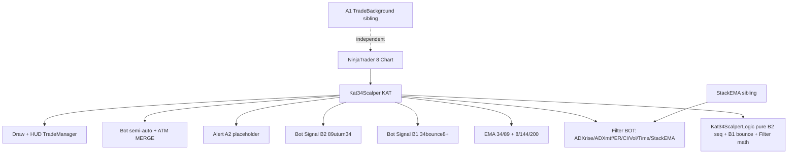

# Project Diary & Graphify Knowledge Base

## 📊 Graphify System Architecture

### Key Entities & Dependencies
- **Component**: `Kat34Scalper` (NinjaTrader Indicator, partial 13 files)
- **Domain Logic**: `Kat34ScalperLogic` (B2 seq `Update`, B1 bounce `UpdateA2`, Filter `EfficiencyRatio/ChoppinessIndex`, ATM parser)
- **Signals**: `B1 34bounce8+` (KatA2State), `B2 89uturn34` (KatA1State), `A1` lives in sibling `nt8-kat-A1-TradeBackground`, `A2` placeholder
- **Filter**: BOT only — `Filter.MarketPassAt/ErPassAt/CiPassAt/AdxMtfPassAt/StackEmaFilterPassAt`
- **Bot**: `Bot` (order), `Bot.Risk` (NY 18:00 session), `Bot.AtmMerge` (MERGE)
- **Draw**: `Draw` (RenderSignal) + `Draw.HudFactory` (TradeManager tokens)
- **Execution Target**: NT8 chart (BarsArray[0] primary, [1] ADX MTF, [2..] StackEMA), `Calculate.OnBarClose`

---

## 📜 Version History & Change Log
### [v1.00] — 2026-08-08
- **Program + Daily Risk quick sets — TradeManager port cho toàn tài khoản**:
  - **Program (Trading Profile 1..8)**: 8 presets whole-account `Account/ATM/Quantity/BufferTicks/DailyMaxDD(Enabled+Value)/DailyMaxProfit(Enabled+Value)` — mỗi profile `Name` max 8 chars (`P1..P8`, `NormalizeProfileName` trong `Kat34ScalperLogic.cs:129`, `Kat34Scalper.cs:7xx` 8 groups `Trading Profile X` Order 1..9). HUD 2 rows ×4 `CreateFourColumnGrid(HudGap)` 22px height, left-aligned `HorizontalContentAlignment.Left` `Padding 4,0,2,0`, `profileOffBg #2D3241 50% transparent` OFF, `profileRowOnBgs` cyan `140,110,110` / pink `135,35,65` ON (TradeManager parity), `ProgramLabelColor` 80% transparent (`ProgramLabelOpacityPercent 20` default), `GetProgramLabelBrush/BuildLabelBrush` copy TradeManager, `SetButtonLabel` + `TextBlock` left `Margin 4,0,0,0` + `ToolTip` (`acc / atm Qty DD TP`). `ApplyTradingProfile` debounce 500ms, set `BotOrderQuantity/BufferTicks/DailyMaxDD+Profit` + `cached*`, sync `accComboBox` + `atmComboBox` + `SyncChartTraderAccount`, `UpdateTradingProfileButtons` uniqueMatch highlight + `activeTradingProfile` fallback, watchdog refresh 500ms. `InitTradingProfileDefaults/SeedTradingProfileDefaults` loop trong `SetDefaults/DataLoaded` (quantity 0→seed Sim101 qty1 buf2 DD500/Profit1000). Custom label: `TradingProfileXName` setter qua `NormalizeProfileName`, displayed via `GetQuickSetButtonTemplate`? Program giữ `CreateButton`+TextBlock pattern như TradeManager — triệt để left align.
  - **Daily Risk Quick Sets**: 6 presets `Name` max 3 chars (`1..6`, `NormalizeAtmSetName`) + `MaxDD/MaxProfit` (defaults 200/500, 100/300, 500/1000, 1000/2000, 1500/3000, 2000/5000) — group `8. Daily Risk Quick Sets` Order 1..18 `Kat34Scalper.cs:7xx`. HUD 6 buttons `CreateSixColumnGrid(HudGap)` 24px height string `Content` + `GetQuickSetButtonTemplate` (TextBlock bound to `Content`, centered, `TextTrimming.Ellipsis`, `CornerRadius 3` — fix NT8 theme clip, triệt để `Content is TextBlock → replace with string`). `dailyRiskPresetOffBg #2D3241 50%` OFF, `dailyRiskPresetOnBg #240748 80% transparent` ON, `GetQuickSetFontSize()+2` adaptive (min 14), `QuickSetLabelColor 50%` base, `FontWeight SemiBold`. `ApplyDailyRiskPreset` set `DailyMaxDD/Profit` + `cached*`, `UpdateDailyRiskPresetButtons` (on = DD==preset && Profit==preset) + `UpdateTradingProfileButtons` + `EvaluateDailyRiskLimits` + status. Tooltip `DD $ / Profit $`.
  - **ATM Quick Sets fix**: cũ `CreateButton(Name)` TextBlock gray OFF → nay `Template=GetQuickSetButtonTemplate`, `Content=string`, `Foreground White`, `FontSize=GetQuickSetFontSize()+2`, `FontWeight SemiBold`, `Padding 1,0,1,0`, `Border 0`, triệt để `Content as string` replace TextBlock bug — giống TradeManager `UpdateAtmSetButtons` (string Content, replace TextBlock). Label custom max 3 chars `NormalizeAtmSetName` hiển thị okie mọi NT8 theme (đặc biệt lưu ý requirement).
  - **HUD style**: new group `HUD` — `QuickSetFontSize` 8 (6–12), `QuickSetLabelColor` White + `QuickSetLabelOpacityPercent` 50, `ProgramLabelColor` White + `ProgramLabelOpacityPercent` 20 (80% transparent default) — props `XmlIgnore` + `Serializable` freeze brush như TradeManager. Helpers `GetQuickSetFontSize/BuildLabelBrush/GetProgramLabelBrush/GetQuickSetLabelBrush/GetButtonLabel` copy TradeManager `KatTradeManagerUI.cs:52` vào `Draw.HudFactory.cs:22`. `GetQuickSetButtonTemplate` thêm `HudFactory.cs:60` (clone TradeManager `HudFactory.cs:60`).
  - **HUD wiring**: `BuildHud` thêm Program 2 rows trước accSelector, ATM quick-sets chuyển sang quick-set template, DailyRisk toggles `MaxDD/MaxProfit` + 6 preset grid sau `dailyRiskGrid` + `UpdateDailyRiskPresetButtons` + `UpdateTradingProfileButtons` watchdog 500ms + acc/atm SelectionChanged refresh profile highlight + `RemoveHud` clear `accComboBox/tradingProfileButtons/dailyRiskPresetButtons`. `accComboBox` promote từ local `var` → field `accComboBox` để `ApplyTradingProfile` sync trực tiếp.
  - Verify: `Run-AllChecks` 3 steps 124 tests 0 warn ALL GREEN; `CompileCheck` net48 0 errors; label display test manual (string Content + quick-set template ensures centered, not clipped on NT8 theme).
  - Graphify mapping: `Kat34Scalper:TradingProfile1..8Name/Account/Atm/Quantity/BufferTicks/DailyMaxDD+Profit`, `DailyRiskSet1..6Name/MaxDD/MaxProfit`, `QuickSetFontSize/ProgramLabelColor`, `Kat34ScalperLogic:NormalizeProfileName`, `Kat34Scalper.Draw:tradingProfileButtons/dailyRiskPresetButtons/UpdateTradingProfileButtons/ApplyTradingProfile/UpdateDailyRiskPresetButtons/ApplyDailyRiskPreset/GetQuickSetButtonTemplate`, `Kat34Scalper.Draw.HudFactory:GetQuickSetButtonTemplate/BuildLabelBrush`.

### [v0.99] — 2026-08-08
- **Re-audit ACCOUNT section — fix + polish**:
  - **Fix Daily stale**: `AccountInfo.cs:313` `dailyOk==false` trước giữ giá trị cũ → nay set `"--"` gray; `catch` cũng set `"--"` (không để số cũ lệch phiên).
  - **Thêm A2 vào header**: `Bots:` line thêm `A2 ON/OFF` (blue `hudOnBrush #007ACC` khi ON, gray OFF) giữa `BOT` và `B1` → `Bots: BOT ON  A2 OFF  B1 ON  B2 OFF  Flat/...` 10px SemiBold, `TextTrimming.Ellipsis` an toàn 250px. Cập nhật `CreateAccountInfoSection` thêm `accountA2Run` + `accountBotSep4`, `UpdateAccountInfoSection` đọc `cachedAlertA2`, `RemoveHud` clear `accountA2Run/ Sep4`.
  - **README**: `HUD ACCOUNT` bullet cập nhật `A2` trong Bots line.
  - Verify: `Run-AllChecks` 3 steps 124 tests 0 warn ALL GREEN; `CompileCheck` net48 0 errors; `graphify update` 798→...
  - Graphify mapping: `Kat34Scalper.AccountInfo:accountA2Run` (A2 header), `Kat34Scalper.Draw:RemoveHud` (A2 clear).
### [v0.98] — 2026-08-08
- **ACCOUNT section — TradeManager-style header (tài khoản/thời gian/chỉ số bot)**:
  - New `src/Kat34Scalper.AccountInfo.cs` (partial class): top black board ported từ `KatTradeManager.AccountInfo.cs` — `HudGap 2`, `HudPanelWidth 250→238 inner`, `UseLayoutRounding/Snaps` trên mọi Border/StackPanel/Grid, card `Background #000000 Border #232A38 CornerRadius 5 Margin 0,0,0,HudGap` + footer 10px đen (TradeManager pattern), không dùng title riêng.
  - Nội dung 6 dòng: **NYT time** (`GetNyTime` EST→America/New_York fallback, date purple #B464FF, time orange #FFA500, 11px `dddd dd, MMM   hh:mm:ss pm (NYT)`), **Acct** (`Sim101 • MNQ` 11px ellipsis), **Balance** (`Balance: $N0` gray), **Day** (`Day: +N0` green/red/gray từ `CalculateDailyPnL`), **U/R grid** 2-col `U: +N0 | R: +N0` (11px, green/red), **Bots** (`Bots: BOT ON/OFF  B1 ON/OFF  B2 ON/OFF  Flat/Long 1/Short 1/PENDING B1 Buy` 10px SemiBold, ON green #28C850 / B1/B2 ON dark-blue #0F3C82, OFF gray #A0A0A0).
  - `BuildHud` chèn `CreateAccountInfoSection()` ngay sau header `⚡ KAT 34-ScalperBot` (trước status), `OnPanelWatchdogTick` gọi `UpdateAccountInfoSection()` mỗi 500ms + immediate sau `BOT ON/OFF`, `accSelector SelectionChanged`, `B1/B2/A2 Click`. `RemoveHud` clear toàn bộ Runs/TextBlocks.
  - Style khớp TradeManager: inner Padding `HudGap, HudGap+4`, height uniform, `TextBlock` `UseLayoutRounding true`, balance fallback `CashValue→TotalCashBalance→NetLiquidation`, PnL coloring ngưỡng 0.005, `N0` invariant.
  - Verify: `Run-AllChecks` 3 steps 124 tests 0 warn ALL GREEN; `CompileCheck` net48 0 errors.
  - Graphify mapping: `Kat34Scalper.AccountInfo:CreateAccountInfoSection/UpdateAccountInfoSection/GetNyTime`, `Kat34Scalper.Draw:BuildHud/OnPanelWatchdogTick/RemoveHud` (account wiring).
### [v0.97] — 2026-08-08
- **Re-audit lần 2 — polish dead code + mermaid + NY safety + CI**:
  - `Bot.AtmMerge.cs:27` xóa write-only `atmMergePosition/StopQuantity/TargetQuantity` (chỉ set không read).
  - `Draw.HudFactory.cs:30` xóa unused `shiftControlBg/toggleOffBgStatic` copy dư TradeManager.
  - `Kat34ScalperLogic.cs:137,290` annotate orphan `PassMarketFilter` (volume-only inline giữ cho test) + A1 legacy `SlopeAngleDeg/A1Direction` (sibling owns A1, giữ cho xunit).
  - `Bot.Risk.cs:28` wrap `GetNySessionStartUtc` trong try/Print return 0 — tránh throw crash watchdog/bar khi zone miss.
  - `DIARY.md:3` mermaid `Kat8934` cũ → mới `Kat34Scalper B1/B2/Filter/Bot/Draw/StackEMA + siblings`.
  - `.github/workflows/ci.yml:22` compile gate trước `exit 0` vô điều kiện → chỉ skip khi log chứa `NinjaTrader.` miss, ngược lại fail thật.
  - Graph stale `b42ceac` → `cf76650` sau `graphify update .` (791 nodes).
  - Verify: `Run-AllChecks` 3 steps 124 tests 0 warn ALL GREEN.
### [v0.96] — 2026-08-08
- **Re-audit full fix (audit 2026-08-08)**: apply toàn bộ findings, tách module + thêm test + tool.
  - **Bug fix high**: `Bot:FlattenAllPositions` thiếu `Instrument.FullName` filter → cancel nhầm order symbol khác `Kat34Scalper.Bot.cs:1141`; `Draw:ClearOldSignalDrawings` chỉ reset B1 state, B2/A2 ghost `Kat34Scalper.Draw.cs:298`; `Signal:diagnosticA0Dir` dead field xóa `Kat34Scalper.Signal.cs:22` + B2 print; `Bot:CalculateDailyPnL` poisoned baseline khi `realizedReadOk=false` vẫn cộng unrealized → early return 0 `Kat34Scalper.Bot.Risk.cs:80`; `Bot:pendingOrderOwner` default `"B1"`→`""` + `SignalOwnerEnabled` unknown→false `Kat34Scalper.Bot.cs:43,179`; dup comment xóa.
  - **Bug fix medium**: `Filter:MarketPassAt` dummy ADX → volume-only inline `Kat34Scalper.Filter.cs:54`; `Draw:RenderSignal` brush alloc → frozen `Kat34Scalper.Draw.cs:90`; `StackEma:NY fallback` Local→throw/ America/New_York `Kat34ScalperLogic.cs:533`; `Bot:Revert` magic 1/2→enum `RevertAction` `Kat34Scalper.Bot.cs:401`; `Signal:B1/B2` filters doc drift.
  - **Docs**: rewrite `README.md:28-91` signals (A0/A1/A3/A4 xóa, chỉ B1/B2 + A2 placeholder + BOT FILTER gates), settings table 6 sections StackEMA, HUD sections BOT/ALERT SIGNAL/BOT SIGNAL/BOT FILTER/DRAW; `AGENTS.md:68` v0.93→v0.96; header `Kat34Scalper.cs:1` module layout thêm Bot.Risk/Bot.AtmMerge/Draw.HudFactory.
  - **Tests**: 112→124 (+12) `Kat34ScalperLogicTests.cs:1091` — PriceEqualsEMA neutral, Filter boundary, BarsAgo single/zero, Cutoff tick, NY DST before/after 18:00, BE negative/zero tick, zero limit breach, session advance, unicode name, IsStop equality, A2 touch exact; `dotnet test` 124 pass.
  - **Module split**: `Bot` 1185→~780 lines: extract `src/Kat34Scalper.Bot.Risk.cs` (session baseline) + `src/Kat34Scalper.Bot.AtmMerge.cs` (400 lines, anchor resize + duplicate/stale cancel + flat grace); `Draw` 1305→~950 lines: extract `src/Kat34Scalper.Draw.HudFactory.cs` (tokens HudGap/HudPanelWidth + CreateButton/GetHudButtonTemplate/SetButtonLabel/Create*Grid/CreateSectionCard/CreateModuleTitle/CreateFilterToggle verbatim TradeManager).
  - **Tools**: `.editorconfig` (cs tab4, ps1 space4, md), `scripts/Check-DocsSync.ps1` (VERSION parity cs/README/DIARY/AGENTS), `scripts/Run-AllChecks.ps1` 2→3 steps (0 docs sync), `tools/CompileCheck/CompileCheck.csproj` NoWarn 0436/0649 (183 warnings suppressed), `.github/workflows/ci.yml` (xunit + docs sync + compile gate).
  - Graphify mapping: `Kat34Scalper.Bot:FlattenAllPositions/ClearOldSignalDrawings/diagnosticA0Dir`, `Kat34Scalper.Filter:MarketPassAt`, `Kat34ScalperLogic:GetNySessionStartUtc/CalculateDailyPnL`, `Kat34Scalper.Bot.Risk/AtmMerge`, `Kat34Scalper.Draw.HudFactory`.
### [v0.95] — 2026-08-08
- **HUD full redesign — TradeManager pixel-perfect port (nt8-hud-design v1.64)**: toàn bộ HUD thiết kế lại theo hệ thống TradeManager.
  - **Tokens**: `HudGap 2` uniform (mọi gap ngang/dọc/inner/outer), `HudPanelWidth 250` → inner `238 = 22+24k` (chia hết cho 2/4/6/8 cols, không còn 0.5px drift), `UseLayoutRounding`+`SnapsToDevicePixels` trên mọi Border/StackPanel/Grid/ComboBox/Button template.
  - **Factory**: copy verbatim `CreateButton` (TextBlock centered + `GetHudButtonTemplate` own ControlTemplate với Border bind Background/BorderBrush/Thickness, ContentPresenter centered Margin 2,0), `SetButtonLabel`, `CreateTwo/Four/Six/EightColumnGrid(HudGap)`, `CreateSectionCard` (card bg #0A0C12 border #232A38 CornerRadius 5 Padding HudGap + footer đen 6px).
  - **Panel**: `Border` Width 250 Padding HudGap Margin HudGap CornerRadius 6 Background Argb(240,20,24,33), `mainPanel` StackPanel snapped, header `⚡ KAT 34-ScalperBot vX` Normal 12 Opacity 0.3 Margin 0,HudGap*2,0,HudGap*2.
  - **Heights**: quick-set 22, toggle 24 (BOT ON/OFF, MaxDD/Profit, A2/B1/B2, Filter 6), exec primary 43 (SELL/BUY MARKET, BE/Revert), Close 59 — uniform trong card, không còn 26 vs 24 hay 33 vs 48 lệch 2px.
  - **Colors**: frozen brushes `hudOn #007ACC`, `hudBotOn #0F3C82`, `hudOff #2D3241`, `atmSetOn #B45A14`/`Off #2D3241`, `dailyOn #3A136B`, `buyMkt #0C3019`/`sellMkt #370F12`, `BE/Revert #161616`, `Close #0A0A0A`, ComboBox black bg #000000 border #232A38.
  - **Grids**: mọi row dùng helper `Create*ColumnGrid(HudGap)`, last row trong card bottomMargin 0, DailyRisk 2 nút share `CreateSixColumnGrid` với `Span5` để center 118-120 pixel-perfect.
  - **Fix**: Border 1px integer (không 1.5), Button template bind đầy đủ, TextBlock foreground sync sau toggle, status TextBlock Background Transparent Height 16.
  - Graphify mapping: `Kat34Scalper.Draw:BuildHud/CreateButton/GetHudButtonTemplate/CreateSectionCard/Create*Grid/SetButtonLabel/HudGap/HudPanelWidth`.
### [v0.94] — 2026-08-06
- A1 separation: A1 is now a STANDALONE indicator (`KatA1TradeBackground`, NT8 menu KAT folder) owned by sibling repo `nt8-kat-A1-TradeBackground` v0.89. Host no longer compiles A1 as a partial class.
- Host dropped A1 settings/series/EMAs/HUD toggle; ADX MTF series renumbered 2→1; StackEMA series mapping starts at 2 and reuses only the ADX MTF series.
- Scalper connects to A1 and consumes its `SignalDirection`/`EpisodeDirection` (pending).

### [v0.93] — 2026-08-06
- **Independent signal repos, no submodules**: A1 and StackEMA now live in their OWN repositories as SIBLING folders of Scalper — not submodules, not nested. Scalper's job is to CONNECT to them by relative path (compile gate + xunit + deploy).
  - Removed the `nt8-kat-A1-TradeBackground` submodule (`.gitmodules` deleted, gitlink removed); A1 stays canonical at `https://github.com/zenaimaster-lab/nt8-kat-A1-TradeBackground`.
  - Created independent `nt8-kat-StackEMA` repo (`https://github.com/zenaimaster-lab/nt8-kat-StackEMA`); moved `src/nt8-kat-StackEMA.cs` + `src/StackEmaLogic.cs` out. Host keeps only the filter adapter `src/Kat34Scalper.StackEMA.cs`.
  - `tools/CompileCheck/CompileCheck.csproj`, `tests/Kat34Scalper.Tests/Kat34Scalper.Tests.csproj`, and `scripts/Deploy-NT8.ps1` now reference the sibling repos by path (`..\nt8-kat-A1-TradeBackground`, `..\nt8-kat-StackEMA`).
  - Replaced `scripts/connect-A1.ps1` with `scripts/connect-Repos.ps1` (verifies both sibling repos).
  - A1 restored: with `StackEMA Filter Enabled` OFF (default) the host adds no StackEMA series, BIP 1 runs untouched, and A1 background bands + signal lines render as before.
  - Graphify entity mapping: `Kat34Scalper.ConfigureStackEma`, `Kat34Scalper.LoadStackEma`, `Kat34Scalper.StackEmaFilterPassAt`, `StackEmaLogic.MapRequestedSeries`, A1 BIP 1 path, sibling repo references.

### [v0.92] — 2026-08-06
- **A1/StackEMA clash fix**: StackEMA filter no longer adds secondary series while disabled. When enabled, it reuses matching A1/zone `Second` series, adds only unique series, and routes mapped BIPs instead of assuming 6-10. No visible StackEMA packs bypass filter and add no StackEMA series.
  - Graphify entity mapping: `StackEmaLogic.MapRequestedSeries`, `Kat34Scalper.ConfigureStackEma`, `Kat34Scalper.LoadStackEma`, A1 BIP 1 path. Secondary BIPs other than A1 now fall through to the existing `BarsInProgress != 0` return with no StackEMA interception.

### [v0.91] — 2026-08-06
- **A1 isolation fix**: Scalper now keeps BIP 0 processing active when StackEMA filter is OFF, adds StackEMA series only when enabled, and reuses existing A1/ADX/zone timeframe series instead of adding duplicate secondary series.
  - Graphify entity mapping: `Kat34Scalper.IsStackEmaSeries`, `StackEmaLogic.MapRequestedSeries`, A1 BIP 1 lifecycle.

### [v0.90] — 2026-08-06
- **StackEMA Brush thread fix**: color-picker brushes are frozen at every assignment, including NT8 property-grid edits and deserialization, preventing cross-thread `Freezable` access errors when adding the indicator.
  - Graphify entity mapping: `StackEMA.FreezeBrush`, `StackEMA.StackedPositive`, `StackEMA.StackedNegative`, `StackEMA.NeutralColor`.

### [v0.89] — 2026-08-06
- **StackEMA settings polish**: standalone display name changed to `KAT-StackEMA`; Positive/Negative/Neutral settings now use NT8 `Brush` color pickers with 50% alpha rendering defaults.
  - Graphify entity mapping: `StackEMA.Name`, `StackEMA.StackedPositive`, `StackEMA.StackedNegative`, `StackEMA.NeutralColor`.

### [v0.88] — 2026-08-06
- **Standalone StackEMA**: added `nt8-kat-StackEMA` with five configurable second-based timeframe packs (defaults 30s/1m/3m/5m/15m), shared EMA periods 89/55/34/21/8, Positive/Negative/Neutral state, 50%-alpha colors, and top-left HUD with per-pack visibility.
- **Scalper filter integration**: added `StackEmaLogic` and `Kat34Scalper.StackEMA.cs`; host adds BIP 6-10 series and applies StackEMA to buy/sell filter using visible packs. All hidden bypasses filter. Reads latest closed secondary bar to avoid look-ahead.
  - Graphify entity mapping: `StackEMA`, `StackEmaLogic.Direction`, `StackEmaLogic.FilterPass`, `Kat34Scalper.StackEmaFilterPassAt`, `nt8-kat-StackEMA` HUD.

### [v0.87] — 2026-08-06
- **A1 connection script**: added `scripts/connect-A1.ps1` to sync and initialize Scalper's pinned A1 submodule after fresh clone, verify canonical A1 source, and print path/commit/remote. Script intentionally does not pull latest A1, preserving parent compatibility pin.
  - Graphify entity mapping: `scripts/connect-A1.ps1`, `.gitmodules`, `nt8-kat-A1-TradeBackground`.

### [v0.86] — 2026-08-06
- **A1 extracted into separate repository**: canonical `Kat34Scalper.AlertSignal.A1.cs` now lives in `nt8-kat-A1-TradeBackground` and is mounted by Scalper as a Git submodule. Removed parent A1 duplicate to prevent source drift and duplicate partial-class members.
  - Parent compile gate includes the A1 sub-repo source; `Deploy-NT8.ps1` copies it into NT8 with all other sources, preserving the existing `Kat34Scalper` partial-class contract and BIP 1 signal behavior.
  - A1 repo owns its version/docs/diary/Graphify/workflow and delegates host xunit, net48 compile, full NT8 sync, and recompile verification to Scalper.
  - Graphify entity mapping: `Kat34Scalper.AlertSignal.A1.cs`, `Kat34Scalper.EvaluateAlertA1Bar`, `Kat34Scalper.BackfillAlertA1`, `Kat34Scalper.EmaZonePassAt`, `Kat34Scalper.DrawEnvBand`, `Kat34Scalper.DrawAlertA1Line`.

### [v0.85] — 2026-08-05
- **Custom alert sounds from local disk**: Alert Sound dropdown + playback now support NT8's user sounds folder `Documents\NinjaTrader 8\sounds` (no admin needed — drop any `.wav` there, it shows up in the dropdown and plays). Resolution order: user folder wins over install folder on equal names, install folder fallback. Converter auto-creates the user sounds folder for discoverability.
  - New pure logic `Kat34ScalperSound.ResolvePath/ListSounds` in `src\Kat34ScalperLogic.cs` + 2 tests (106 total). `Kat34ScalperSoundConverter` (Kat34Scalper.cs) and `PlayAlertSound` (Kat34Scalper.Draw.cs) both route through it.
  - Graphify entity mapping: `Kat34ScalperSound`, `Kat34ScalperSoundConverter`, `Kat34Scalper.PlayAlertSound`.

### [v0.84] — 2026-08-04
- **Chart-top version label removed** (the `Kat34Scalper v0.83 (...) [30 Second]` TextFixed line): `ShowVersion` setting, `DrawVersionLabel`, `ChartTimeframe`, `versionDrawn` all deleted.
- **A1 renamed `fan 30s` → `EmaZone30s`** everywhere visible: HUD toggle `A1 (EmaZone30s)`, settings group `2. Alert Signal A1 — EmaZone30s`, docs.
- **A1 EmaZone gate (3 higher-TF conditions)**: new settings `Cond: EMA34 zone TF1/2/3` (enum dropdown S90/M1/M2/M3/M5/M15/M30, defaults 3m/5m/15m). For an environment to be valid, the last CLOSED zone bar's close must sit on the episode side of that TF's EMA34 — LONG above, SHORT below (mirrored per direction, user-confirmed). Three extra Second series (BarsArray[3..5], always added for stable indexes) + `zoneEma34` EMAs; gate math reuses the ADX-MTF no-lookahead cutoff (`ClosedBarCutoff` + `BarsAgoAtOrBefore`) on the A1 series, backfill-replay aware; warmup = gate open. Pure `Kat34ScalperLogic.EmaZonePass(dir, close, ema)` + 1 test (104 total). Applied in `EvaluateAlertA1Bar` and `BackfillAlertA1` right after the fan direction, before debounce/edge step.
  - Graphify entity mapping: `KatEmaZoneTf`, `Kat34ScalperLogic.EmaZonePass`, `Kat34Scalper.zoneEma34/EmaZonePassAt`, `AlertA1EmaZoneTf1/2/3`, A1 `EvaluateAlertA1Bar/BackfillAlertA1` (zone-zeroed rawDir).

### [v0.83] — 2026-08-04
- **HUD title renamed to "KAT 34-ScalperBot"** (HUD only; chart version label untouched).
- **Close/flatten button height doubled** (33 → 66) for fat-finger safety.
- **Bulenox sync root cause found + fixed**: user screenshots showed Chart Trader's account selector renders Rithmic accounts as `Name!Connection!Connection` (e.g. `BX45272-51!Bulenox!Bulenox`) while `Account.Name` stays short (`BX45272-51`) — the exact string match never hit. `SyncChartTraderAccount` now matches by `Account.Name` first, then exact ToString, then `name!` prefix. Sim/FN/TPT accounts (no suffix) keep matching as before.
  - Graphify entity mapping: `Kat34Scalper.SyncChartTraderAccount` (3-way match), HUD title/Close-flatten layout.

### [v0.82] — 2026-08-04
- **HUD tidy**: dropped the "BOT" module title above the top section and the "Acc:" label — the account ComboBox is now full-width at the very top of the HUD.
- **Chart Trader sync diagnosis**: BAML + metadata inspection of NinjaTrader.Gui proved Chart Trader's account picker is `NinjaTrader.Gui.Tools.AccountSelector : ComboBox`, and its item list is filtered by NT8 itself (`OnAccountStatusUpdate` connection-status predicates, `OnGlobalSimulationModeChanged`, `IsSimulationAccount`) — it only offers accounts of currently connected connections and never lists the internal Backtest/Playback accounts. So HUD picks of Backtest/Playback/disconnected-connection accounts (e.g. Bulenox/BX-* while that Rithmic connection is not connected) physically cannot be mirrored — the target combo has no such item. `SyncChartTraderAccount` now Prints the selector's actual listed accounts when a pick cannot be synced (one line, only on no-match).
  - Graphify entity mapping: `Kat34Scalper.SyncChartTraderAccount` (no-match diagnostic), HUD BOT section layout.

### [v0.81] — 2026-08-04
- **HUD account pick now drives Chart Trader's account selector**: NT8 only renders chart orders for the account selected in Chart Trader itself, so picking the account on the HUD alone still required a second manual pick in Chart Trader to see the bot's orders on the chart. `SyncChartTraderAccount` mirrors the HUD pick into Chart Trader's account ComboBox — located by item content (account names) in the ChartTrader visual tree, which survives NT8 template/layout changes better than hardcoded element names; silent no-op when Chart Trader is hidden. Pattern ported verbatim from `nt8-kat-TradeManager` (battle-tested there). Fires on HUD build (initial/default selection) and on every `SelectionChanged`.
- Helpers added to Draw module: `SyncChartTraderAccount`, `GetChartTraderControl`, `FindVisualChildByTypeName`, `FindAllVisualChildren<T>`. No pure-logic change; tests stay 103; compile gate green.
  - Graphify entity mapping: `Kat34Scalper.SyncChartTraderAccount/GetChartTraderControl` (Draw module, HUD acc combo wiring).

### [v0.80] — 2026-08-04
- **A1 Break Bars unified with the invalid decision (episodes/bands)**: the edge-trigger debounce (`A1EdgeStep`) already absorbed 1-2 bar wobbles for alert lines, but episode bands + gray ranging lines judged the environment invalid on the FIRST raw invalid bar — episodes visibly fractured on every wobble while no new alert line fired, so "Break Bars (invalid before re-arm)" looked dead. New pure `Kat34ScalperLogic.A1DebouncedDir(dir, lastDir, invalidStreak, breakBars)`: an armed environment keeps counting until invalid for `breakBars` consecutive bars (flip passes through immediately, same rule as the edge step). `EvaluateAlertA1Bar` + `BackfillAlertA1` now feed debounced dir to the band/episode/ranging-line logic and the raw dir to `A1EdgeStep` (pre-step state), so episode end, ranging line and re-arm land on the same bar (pinned by `A1DebouncedDir_MatchesEdgeStepDisarmBar`).
- Tests 98 → 103 (5 A1DebouncedDir cases); compile gate green.
  - Graphify entity mapping: `Kat34ScalperLogic.A1DebouncedDir`, `EvaluateAlertA1Bar/BackfillAlertA1` (rawDir vs debounced dir split).

### [v0.79] — 2026-08-04
- **Alert-side filters abolished — A1 is now a pure EMA fan**: every gate moved to the single Bot filter side; the ALERT FILTER HUD section is gone. A1 episodes/bands/edge lines run on the fan + angle alone (`EvaluateAlertA1Bar`/`BackfillAlertA1` no longer call any market gate).
- **Moved gates**: `ADX rising` and `ADX MTF` (both were A1-only alert legs) now gate B1/B2/A2 on series 0 via `MarketPassAt` — ADX MTF keeps the no-lookahead `ClosedBarCutoff` mapping (`Filter.AdxMtfPassAt` + generalized `SeriesPeriodSeconds`; non-time chart series stay conservative). Alert-side ER/CI duplicates (`cachedErA`/`cachedCiA`) dropped — the existing Bot ER/CI remain.
- **Orphans removed**: `A1LineGateStep` (pure logic) + its 4 xunit cases incl. the subset-property test (no consumer once gates left A1), `a1LinePending`, `AlertA1MarketPassAt`, `Series0BarsAgoAt`, `A1ClosedCutoff`, `SetAlertFilterToggle`, `SetAlertA1AdxMtf`, `ReBackfillAlertA1`, `PassAlertFilters(At)`, dead `AdxRisingEnabled` setting.
- **Settings**: `AlertA1AdxMtfMinutes/Period/Min` renamed to `AdxMtfMinutes/Period/Min` and moved to group "1. Filters" (rename drops stale saved values, defaults 3m/14/22 unchanged); `AlertA1AdxMtfEnabled` deleted (session-only HUD toggle like every other gate). A2 placeholder now consumes the Bot filter pipeline.
- **HUD**: BOT FILTER = [ADX rising | ADX MTF] + [ER (trend) | CI (chop)] + [Volume | Time window]; bot toggles stay plain (no re-backfill — B1/B2 pick toggles up on live bars + next backfill, same as the pre-existing Volume/Time/ER/CI buttons).
- Tests 102 → 98 (4 LineGate cases deleted with the orphaned logic); compile gate green; NT8 recompile accepted.
  - Graphify entity mapping: `Filter.AdxMtfPassAt/SeriesPeriodSeconds`, `cachedAdxRise/cachedAdxMtf` (bot side), `EvaluateAlertA1Bar/BackfillAlertA1` (gate-free), HUD BOT FILTER rows, `AdxMtfMinutes/Period/Min`.

### [v0.78] — 2026-08-04
- **Environment bands actually render now (the long-standing green/red background bug)**: `DrawEnvBand`'s guards were written for barsAgo arguments (`barsAgoStart <= barsAgoEnd → return`), but every caller passes ABSOLUTE bar indexes where a valid episode always has `startIdx < endIdx` — so the guard rejected EVERY episode and the rectangle was never drawn (backfill or live). The v0.73/v0.75 "visible band" analyses verified the time-anchor math and missed the guard direction — owned. The decision + index→barsAgo conversion now lives in pure, tested `Kat34ScalperLogic.EnvBandAnchors(dir, startIdx, endIdx, hi, lo, currentBarIdx, out agoStart, out agoEnd)`; `DrawEnvBand` is a thin wrapper over it.
- **Tests 98 → 102**: valid episode draws with correct barsAgo anchors (agoStart > agoEnd, older bar = larger barsAgo), ranging (dir 0) not drawn, zero-length episode (startIdx == endIdx) not drawn, flat extent (hi == lo) not drawn.
- Note: band fill stays areaOpacity 8 (deliberately pale). If it reads as "too faint" on your theme, the fix is the `8` in `DrawEnvBand` — one constant.
  - Graphify entity mapping: `Kat34ScalperLogic.EnvBandAnchors`, `Kat34Scalper.DrawEnvBand` (guard fix + index semantics).

### [v0.77] — 2026-08-04
- **Plain ADX toggles removed (both sides)** per user request: the ALERT FILTER "ADX" button (`cachedAdxA`) and the BOT FILTER "ADX" button (`cachedAdx`) are gone, together with both gate clauses (`AlertA1MarketPassAt` alert leg + `MarketPassAt` shared leg). The alert side keeps its ADX family via the A1-only `ADX rising` + `ADX MTF (A1)` legs; the bot side keeps Volume/Time/ER/CI. `PassMarketFilter` pure logic untouched (bot caller now passes the ADX leg open: `0, 0`).
- **Orphaned `AdxMin` setting deleted** with the gates (it had no consumer left — same dead-control trap as the v0.76 MTF button). `AdxPeriod` stays: `adxInd` still feeds the ADX-rising leg.
- HUD repacked: ALERT FILTER rows = [ADX rising (A1) | ER (trend)] + [CI (chop) | ADX MTF (A1)]; BOT FILTER rows = [Volume | Time window] + [ER (trend) | CI (chop)]. GATE diagnostic print dropped the adx slot.
- No test changes: pure `PassMarketFilter` semantics unchanged; 98 tests green.
  - Graphify entity mapping: `cachedAdx/cachedAdxA/AdxMin` (removed), HUD ALERT/BOT FILTER rows, `MarketPassAt`/`AlertA1MarketPassAt` (ADX clauses removed).

### [v0.76] — 2026-08-04
- **Filter/alert re-audit round 2 — dead MTF toggle removed**: the BOT FILTER "MTF" HUD button flipped `cachedMtf`, but no gate read it — orphan of the A0-era MTF fan (3m/5m/15m) that died when A0 was removed in v0.56. Toggling it did nothing while looking armed. Button + field + stale header mentions deleted; a real MTF fan gate would be a feature (new series/EMAs/settings), not a fix.
- **AdxRisingBars=0 footgun clamped**: with Lookback 0 the alert-side ADX-rising leg compared `adxInd[ago0] <= adxInd[ago0]` — always true, so the gate stayed permanently closed and silently killed every A1 alert while the toggle was ON. Now `Math.Max(1, AdxRisingBars)`.
- **Tests 95 → 98**: `A1EdgeStep_FlipDuringDebounceStreak_FiresWithoutFullBreak` (pins the documented "direction flip always fires" mid-streak), `Market_AdxExactlyAtMin_Passes` (boundary), `Er_DegenerateWindow_IsZero` (null/single bar).
- Audit notes (no change): `diagnosticA0Dir` never assigned (CS0649, pre-existing dead field); `TimePassAt` garbage time strings fall back to window-open (acceptable); ER/CI gates allocate per call (perf only).
- No new tooling needed.
  - Graphify entity mapping: `Kat34Scalper.cachedMtf` (removed), HUD BOT FILTER "MTF" button (removed), `AlertA1MarketPassAt` (riseBars clamp).

### [v0.75] — 2026-08-04
- **Alert filter/signal re-audit — backfill lookahead fixed**: the A1 alert gates (`AlertA1MarketPassAt` series-0 legs ADX/ADX-rising/ER/CI + `A1AdxMtfPassAt`) searched target-series bars "opened at or before the A1 bar time". Live evaluation only ever sees CLOSED target bars, but the one-shot backfill searches the COMPLETE series — so near gate thresholds the backfill could read a target bar that had not closed yet at the A1 bar's close (lookahead, backfill≠live). New pure `Kat34ScalperLogic.ClosedBarCutoff(sourceOpen, sourceSecs, targetSecs)` = sourceClose − targetPeriod; new `A1ClosedCutoff(ago, series)` wrapper (Second/Minute periods; non-time target series stay at the A1 open — conservative). Live behavior unchanged; backfill now matches live.
- **Load sound spam killed**: `EvaluateAlertA1Bar` runs on every historical 30s bar and its fire block called `PlayAlertSound()` unguarded — NT8 plays sounds on historical bars, so every load/F5 machine-gunned one sound per historical environment edge. Sound + its Print now gated to `State == State.Realtime` (line drawing stays — backfill overwrites same tags).
- **Tests 91 → 95**: 4 `ClosedBarCutoff` cases — slower MTF target excludes the not-yet-closed bar / admits it once closed (composed with `BarsAgoAtOrBefore`), faster target admits bars closed by the source close, non-time target falls back to the source open.
- Audit notes (no change): `MarketPassAt` bot path re-checks the ADX leg inside `PassMarketFilter` after line-76 already gated it (harmless redundancy); `DrawEnvBand` param names say barsAgo but receive absolute bar indexes — the double conversion cancels, math verified correct on both live and backfill paths; ER/CI legs fail-closed at the history edge (intended, conservative).
- No new tooling needed: xunit + net48 compile gate + live NT8 recompile cover the fix.
  - Graphify entity mapping: `Kat34ScalperLogic.ClosedBarCutoff`, `Kat34Scalper.A1ClosedCutoff`, `AlertA1MarketPassAt`/`A1AdxMtfPassAt` (cutoff call sites), `EvaluateAlertA1Bar` (Realtime sound gate).

### [v0.74] — 2026-08-04
- **Full filter/A1 audit**: one real bug fixed — band hi/lo fields initialized 0/0, so when backfill skipped warmup the live band could anchor lo=0 (prices are always positive, the `< a1BandLo` update never fired); now Min/MaxValue at declaration and in `ClearAlertA1Drawings`.
- **Decomposition**: the duplicated cross-series binary search (series-0 mapping + MTF mapping) extracted to pure `Kat34ScalperLogic.BarsAgoAtOrBefore(timeAt, maxBarsAgo, t)`; A1 wrappers are one-liners.
- **Tests 86 → 91**: 4 BarsAgoAtOrBefore cases (exact/between/older/newer) + the common-sense property test `LineGate_FilterOn_NeverMoreLinesThanOff` (simulated env/gate sequences through A1EdgeStep+A1LineGateStep assert lines(ON) ≤ lines(OFF)).
- No new tooling needed: xunit (pure logic) + net48 compile gate + live NT8 recompile already cover the three layers.
  - Graphify entity mapping: `Kat34ScalperLogic.BarsAgoAtOrBefore`, `Kat34Scalper.a1BandHi/a1BandLo` init, test `CountLines` simulator.

### [v0.73] — 2026-08-04
- **Filters no longer ADD lines (subset semantics)**: gating the environment direction with the market filters fragmented LONG/SHORT episodes, so enabling a stricter filter produced MORE edge-trigger lines — the opposite of common sense. Episodes now run on the fan alone; pure `Kat34ScalperLogic.A1LineGateStep` defers each episode's line to the first bar the ALERT FILTER passes (pending dropped when the episode dies). Filters can now only remove or delay lines (3 new xunit cases; 86 green).
- **Environment bands finally visible**: the invisible-band bug was the Draw.Rectangle fill overload — its last int is `areaOpacity` (0-100), not line width; passing 1 rendered a 1%-opacity area. Verified the exact overloads by decoding NinjaTrader.Custom.dll metadata (System.Reflection.Metadata probe). Bands now use the time-anchored overload `(isAutoScale, startTime, startY, endTime, endY, brush, areaBrush, areaOpacity)` with solid green/red area at opacity 8, anchored by A1 bar times (no series-mismatch).
- 86 tests green; compile gate green; NT8 live recompile accepted.
  - Graphify entity mapping: `Kat34ScalperLogic.A1LineGateStep`, `Kat34Scalper.a1LinePending`, `DrawEnvBand` (time anchor + areaOpacity), `AlertA1DirectionAt` (fan-only).

### [v0.72] — 2026-08-04
- **Filter-toggle re-backfill fixed (signals vanished)**: `ReBackfillAlertA1` (used by every ALERT FILTER button + ADX MTF (A1)) cleared the A1 drawings but never set `alertA1BackfillPending`, so `FlushAlertBackfill` no-opped and after 1-2 toggle presses all A1 lines/bands stayed gone. Now sets the pending flag before the flush — toggles redraw lines AND environment bands on every ON/OFF press.
- **Ranging-start gray line**: width 1 → 2 (dash kept).
- 83 tests green; compile gate green; NT8 live recompile accepted.
  - Graphify entity mapping: `Kat34Scalper.ReBackfillAlertA1` (pending flag), `DrawAlertA1RangeLine` (width 2).

### [v0.71] — 2026-08-04
- **Environment background fixed & segmented**: the whole-chart tint rectangle (v0.70) painted the current color over the entire chart (a SHORT episode still showed green history) and leaked onto lower indicator panels. Replaced with per-episode pale `Draw.Rectangle` bands (alpha 10): LONG episode = pale green, SHORT = pale red, ranging = no band; barsAgo-anchored fill overload (the only NT8 Rectangle overload with a fill brush) so bands sit only in the candle panel. Bands replayed in backfill and extended live each bar.
- **Gray vertical line** marks the start of every ranging episode (live + backfill), tag `K34S_ALERTA1_VR_*`.
- **GLOBAL FILTER split into ALERT FILTER + BOT FILTER** (independent session toggles): ALERT (ADX, ADX rising (A1), ER, CI, ADX MTF (A1)) gates A1+A2 — A1 applies them backfill-aware via series-0 time mapping (`Series0BarsAgoAt`); BOT (MTF, ADX, Volume, Time window, ER, CI) gates B1+B2. A2 backfill/live now uses `PassAlertFiltersAt`. Note: A2 lost the volume/time legs it inherited from the old global gate (placeholder module, default OFF). Alert-side toggles re-backfill A1 on flip so lines/bands match instantly.
- 83 tests green; compile gate green; NT8 live recompile accepted.
  - Graphify entity mapping: `Kat34Scalper.a1BandDir/a1BandStartIdx/a1BandHi/a1BandLo`, `DrawEnvBand`, `DrawAlertA1RangeLine`, `Series0BarsAgoAt`, `AlertA1MarketPassAt`, `PassAlertFilters(At)`, `cachedAdxA/cachedErA/cachedCiA`, HUD sections ALERT FILTER / BOT FILTER.

### [v0.70] — 2026-08-04
- **HUD polish + environment tint**: GLOBAL FILTER buttons now breathe — uniform 4px row gaps + 6px column gap (was glued rows), `ADX rising` renamed `ADX rising (A1)` and paired beside `ADX MTF (A1)` (A1-only gates together), `ER (trend)` + `CI (chop)` on their own row.
- **Chart environment tint**: while the A1 environment is LONG the whole chart gets a very pale transparent green wash (alpha 16/255), SHORT a pale red wash, ranging/A1-OFF no wash. WPF `Rectangle` overlay in the chart host grid (ZIndex 9998, under the HUD canvas, `IsHitTestVisible=false`), refreshed on A1 direction transitions, after backfill, and cleared with A1 drawings.
- **A1 vertical lines dark**: defaults LimeGreen/Red → DarkGreen/DarkRed; properties renamed `AlertA1LongLineColor`/`AlertA1ShortLineColor` (v0.67-style orphaning so stale saved bright values drop).
- 83 tests green; compile gate green; NT8 live recompile accepted.
  - Graphify entity mapping: `Kat34Scalper.envTintRect`, `Kat34Scalper.UpdateEnvTint(dir)`, `AlertA1LongLineColor/AlertA1ShortLineColor`, HUD row layout (GLOBAL FILTER).

### [v0.69] — 2026-08-04
- **Range-regime filters for 30s scalping** — four new gates, each with a friendly HUD toggle button in the GLOBAL FILTER section (session-only, boot OFF like the existing gates):
  - **ADX tuned**: default `AdxPeriod` 14→60 (30-min regime window on 30s; 14 = 7 min whipsaws). New `ADX rising` leg (`AdxRisingEnabled` default OFF / `AdxRisingBars` 5): only entries while ADX above its value N bars ago — blocks dying-trend chops.
  - **`ER (trend)` gate**: Kaufman Efficiency Ratio, pure `Kat34ScalperLogic.EfficiencyRatio` (xunit-tested: flat=0, perfect trend=1, sawtooth<0.25). Defaults 40 bars / min 0.25 (random-walk noise floor at N=40 ≈ 0.13).
  - **`CI (chop)` gate**: Choppiness Index, pure `Kat34ScalperLogic.ChoppinessIndex` (xunit-tested: trend<38.2, sawtooth>61.8, flat=100). Defaults 40 bars / max 50.
  - **`ADX MTF (A1)` gate**: independent regime gate living in the A1 sub-module (NOT Global Filter): ADX(14) on a dedicated 3-minute series (BarsArray[2], always added for index stability), default min 22, default OFF. Backfill replays via binary search over `Times[2]` picking the last MTF bar closed at/before each A1 bar time (no lookahead); the HUD button re-backfills A1 instantly so history lines match the toggle.
  - 83 tests green; compile gate (net48 + NT8 assemblies) green; NT8 live recompile accepted.
  - Graphify entity mapping: `Kat34ScalperLogic.EfficiencyRatio/ChoppinessIndex`, `Kat34Scalper.adxMtfInd`, `cachedAdxRise/cachedEr/cachedCi/cachedA1AdxMtf`, `Kat34Scalper.ErPassAt/CiPassAt`, `Kat34Scalper.A1AdxMtfPassAt/SetAlertA1AdxMtf`, HUD buttons `ADX rising / ER (trend) / CI (chop) / ADX MTF (A1)`.

### [v0.68] — 2026-08-04
- **A1 fan completed to 5 EMAs (8>34>89>144>200), both LONG and SHORT**: user audit caught a LONG line firing while EMA34 still below EMA89 — the v0.64 spec omitted the 89 link. Added `AlertA1CondEma34Above89` + renamed `AlertA1CondEma34Above144` → `AlertA1CondEma89Above144` (stale saved values orphan; defaults true). Dedicated `a1Ema89` on the A1 30s series. Transitional fans (fast EMAs turned, 34 vs 89 unconfirmed) now block both sides — xunit `A1Direction_TransitionalFan_34Below89_BlocksBothSides`. 77 tests green.
  - Graphify entity mapping: `Kat34Scalper.a1Ema89`, `AlertA1CondEma34Above89/AlertA1CondEma89Above144`, `Kat34ScalperLogic.A1Direction` (5-EMA fan).

### [v0.67] — 2026-08-04
- **A1 angle gate property renamed `AlertA1CondAngle` → `AlertA1AngleEnabled`**: NT8 restores saved per-chart property values over SetDefaults — charts saved under v0.65 kept `AlertA1CondAngle=true`, silently overriding the v0.66 OFF default and blocking every signal. The rename orphans the stale saved value so the OFF default truly applies; user can re-enable from settings.
- Added A1 gate diagnostics: `[AlertA1][GATE]` print on direction change (dir, angle, min, enabled, EMA stack, ATR) + backfill summary prints active settings — verify live behavior from the NT8 Output window.
- New xunit case: slope = 0.5 x norm reads ~26.6° (documents why 30° rarely passes on 30s bars). 76 tests green.
  - Graphify entity mapping: `Kat34Scalper.AlertA1AngleEnabled`, `Kat34Scalper.a1PrevDir`, `Kat34Scalper.AlertA1DirectionAt(ago, out angle)`.

### [v0.66] — 2026-08-04
- **A1 angle gate default OFF**: on 30s bars the EMA34 slope-per-bar is tiny vs ATR, so the 30° gate almost never passed and A1 drew nothing. `AlertA1CondAngle` now defaults false — A1 fires on the EMA stack alone until the angle gate is enabled manually. New xunit case proves tiny-slope blocks with the gate ON and fires with it OFF (75 tests green).
  - Graphify entity mapping: `Kat34Scalper.SetDefaults` (AlertA1CondAngle default), `Kat34ScalperLogicTests.A1Direction_TinySlopeVsNorm...`.

### [v0.65] — 2026-08-04
- **A1 fan 30s tuning: break debounce + auto ATR angle normalization**:
  - `AlertA1BreakBars` (default 3): after a fired environment, the condition must stay invalid this many consecutive A1 bars before it counts as broken ("điều kiện phá vỡ") — 1-2 bar stack/angle wobbles no longer re-fire a line. Direction flip LONG↔SHORT still fires immediately. Pure `Kat34ScalperLogic.A1EdgeStep` (xunit-tested, 74 tests green).
  - Removed `AlertA1AngleNorm` manual setting — angle now normalized by `ATR(AlertA1AtrPeriod)` on the A1 series (45° = 1 ATR/bar slope), auto-adapts per instrument; ATR period itself is a setting (default 14) for experimentation. `Min Angle` stays user-tunable (default 30, not fixed).
  - Graphify entity mapping: `Kat34Scalper.a1Atr`, `AlertA1BreakBars/AlertA1AtrPeriod` settings, `Kat34ScalperLogic.A1EdgeStep`, `Kat34Scalper.EvaluateAlertA1Bar/BackfillAlertA1` (debounce state).

### [v0.64] — 2026-08-04
- **Alert Signal A1 implemented: fan 30s (independent, alert-only)**:
  - A1 runs on its OWN secondary series (`AddDataSeries(Data.BarsPeriodType.Second, AlertA1PeriodSeconds)`, default 30s) with its OWN EMA 8/34/144/200 on `BarsArray[1]` — shares nothing with Bot Signals B1/B2 (no series, EMAs, states, signalRecords).
  - LONG environment: ema8 > ema34 > ema144 > ema200 AND ema34 slope angle >= +Min Angle (rising). SHORT mirrored with falling angle. Each condition has its own settings toggle.
  - Edge trigger: one vertical line (dash, width 2 default, LONG lime / SHORT red — colors configurable) + one global Alert Sound per invalid->valid transition. Tags `K34S_ALERTA1_VL_*`; OFF removes only A1 drawings.
  - Slope angle normalized: `atan(delta_ema34 / AlertA1AngleNorm)` degrees — zoom-independent, backfillable. `AlertA1AngleNorm` = price/bar that counts as 45 deg (tune per instrument).
  - Pure logic `Kat34ScalperLogic.SlopeAngleDeg` + `Kat34ScalperLogic.A1Direction` (xunit-tested, 68 tests green). Backfill replays History Days on the 30s series (no sound), syncs edge state; Global Filter not applied (A1 independence).
  - Default ON; HUD button renamed `A1 (fan 30s)`; settings group `2. Alert Signal A1 — fan 30s`.
  - Graphify entity mapping: `Kat34Scalper.a1Ema8/34/144/200`, `Kat34Scalper.EvaluateAlertA1Bar` (bip1 branch), `Kat34Scalper.AlertA1DirectionAt`, `Kat34Scalper.DrawAlertA1Line`, `Kat34Scalper.BackfillAlertA1`, `State.Configure` (AddDataSeries), `Kat34ScalperLogic.SlopeAngleDeg/A1Direction`.

### [v0.63] — 2026-08-03
- **Swap Bot Signal Names and Positions**:
  - Re-assigned Bot Signal names and ordering:
    - **B1 (34bounce8+)**: 34+8+Bounce ema34 touch setup (`src/Kat34Scalper.Signal.B1.cs`).
    - **B2 (89uturn34)**: 89-34 pullback U-turn setup (`src/Kat34Scalper.Signal.B2.cs`).
  - Swapped property display groups and HUD positions so `B1 (34bounce8+)` appears first and `B2 (89uturn34)` appears second.
  - Graphify entity mapping: `Kat34Scalper.cs`, `src/Kat34Scalper.Draw.cs`, `src/Kat34Scalper.Signal.B1.cs`, `src/Kat34Scalper.Signal.B2.cs`.

### [v0.62] — 2026-08-03
- **HUD Dark Blue BOT Signal Buttons & GLOBAL FILTER Hierarchy**:
  - Updated HUD button styling: BOT Signal buttons (`B1`, `B2`) now render in **dark blue** (`#0F3C82`) when ON, while Alert Signal buttons (`A1`, `A2`) retain standard blue (`#007ACC`).
  - Renamed HUD section from `FILTER` to `GLOBAL FILTER`.
  - Enforced Global Filter evaluation across ALL signals: `PassFilters` / `PassFiltersAt` now gate both Alert Signals (`A1`, `A2`) and Bot Signals (`B1`, `B2`).
  - Preserved signal-specific filter settings per sub-module in indicator properties.
  - Graphify entity mapping: `Kat34Scalper.cs`, `src/Kat34Scalper.Draw.cs`, `src/Kat34Scalper.AlertSignal.A1.cs`, `src/Kat34Scalper.AlertSignal.A2.cs`, `src/Kat34Scalper.Signal.B1.cs`, `src/Kat34Scalper.Signal.B2.cs`.

### [v0.61] — 2026-08-03
- **Introduce ALERT SIGNAL Section & Rename Bot Signals to B1/B2**:
  - Added new `ALERT SIGNAL` module section placed above `BOT SIGNAL` in NinjaScript properties and HUD, with 2 placeholder sub-modules (`A1` and `A2`).
  - `ALERT SIGNAL` sub-modules generate alert sounds and chart drawings/markers only, completely isolated from Bot order execution.
  - Renamed existing Bot signals from A1 (89/34 Pullback) to **Bot Signal B1** (`src/Kat34Scalper.Signal.B1.cs`) and A2 (34+8+Bounce) to **Bot Signal B2** (`src/Kat34Scalper.Signal.B2.cs`).
  - Updated drawing prefixes (`K34S_ALERTA1_`, `K34S_ALERTA2_`, `K34S_B1_`, `K34S_B2_`) and HUD sections.
  - Graphify entity mapping: `Kat34Scalper.cs`, `src/Kat34Scalper.AlertSignal.cs`, `src/Kat34Scalper.AlertSignal.A1.cs`, `src/Kat34Scalper.AlertSignal.A2.cs`, `src/Kat34Scalper.Signal.cs`, `src/Kat34Scalper.Signal.B1.cs`, `src/Kat34Scalper.Signal.B2.cs`, `src/Kat34Scalper.Bot.cs`, `src/Kat34Scalper.Draw.cs`.

### [v0.60] — 2026-08-03
- **Fix ATM MERGE Scaling Execution & Real-Time Event Sync**:
  - Identified root cause of MERGE failure: Scalper lacked `Account.OrderUpdate` subscription and 500ms `panelWatchdog` timer, causing MERGE reconciliation to never run on order fills or scaling events.
  - Subscribed to `subscribedAccount.OrderUpdate += OnAccountOrderUpdate` in `src/Kat34Scalper.Bot.cs` to trigger `ScheduleAtmBracketMerge()` instantly upon any order fill or state change.
  - Added 500ms `panelWatchdog` WPF DispatcherTimer in `src/Kat34Scalper.Draw.cs` matching TradeManager's `OnPanelWatchdogTick`.
  - Restored `PlaceMarketOrder(...)` to match TradeManager 100%, removing custom cancel hacks so scale-in, scale-out, and partial fills properly trigger MERGE anchor quantity updates (e.g. 4 -> 3 contracts) and clean duplicate/stale bracket removal.
  - Graphify entity mapping: `Kat34Scalper.cs`, `src/Kat34Scalper.Bot.cs`, `src/Kat34Scalper.Draw.cs`.

### [v0.59] — 2026-08-03
- **Port Full ATM Bracket MERGE Engine (Always ON)**:
  - Ported the entire ATM Bracket MERGE reconciliation engine from `nt8-kat-TradeManager` into `src/Kat34Scalper.Bot.cs`.
  - Configured MERGE as **always ON by default** (no HUD button required).
  - Implemented `MergeAtmBrackets()` & `ScheduleAtmBracketMerge()`:
    - Position active: consolidates all Stop Loss bracket orders into 1 canonical Stop anchor with `QuantityChanged = position.Quantity`, and all Target bracket orders into 1 canonical Target anchor with `QuantityChanged = position.Quantity`.
    - Automatically cancels all duplicate bracket orders (`duplicates`) and stale opposite bracket orders (`staleOppositeBrackets`).
    - Position flat: enforces `ShouldDeferAtmFlatCleanup` (3000ms grace period after entry startup) and cancels all candidate bracket orders when flat (`ATM MERGE flat cleanup`).
  - Added pure logic helpers `ShouldDeferAtmFlatCleanup` and `IsAtmExitAction` to `src/Kat34ScalperLogic.cs`.
  - Added unit tests in `tests/Kat34Scalper.Tests/Kat34ScalperLogicTests.cs` (60/60 tests passing).
  - Graphify entity mapping: `Kat34Scalper.cs`, `src/Kat34Scalper.Bot.cs`, `src/Kat34ScalperLogic.cs`, `tests/Kat34Scalper.Tests/Kat34ScalperLogicTests.cs`.

### [v0.58] — 2026-08-03
- **Fix Orphan Working Orders & Opposite Market Order Execution**:
  - Resolved issue where clicking `SELL market` while Long (or `BUY market` while Short) left orphan SL/TP orders on the chart when position flattened or closed.
  - Implemented `CancelWorkingOrdersForInstrument(acc)` in `src/Kat34Scalper.Bot.cs` to cancel all existing working orders for the instrument before executing opposite market orders.
  - Updated `PlaceMarketOrder(...)`: if the market order is opposite and closes the position (`qty <= pos.Quantity`), submits a clean market close order without launching a new ATM strategy (preventing new orphan brackets on a 0-contract position).
  - Added `CleanupFlatOrphans()` running on bar/watchdog updates: automatically detects when position is Flat (0 contracts) and cancels any orphan working Stop/Limit bracket orders on the account for that instrument.
  - Added `ShouldCancelFlatOrphans` helper to `src/Kat34ScalperLogic.cs` and unit test in `tests/Kat34Scalper.Tests/Kat34ScalperLogicTests.cs` (58/58 tests passing).
  - Graphify entity mapping: `Kat34Scalper.cs`, `src/Kat34Scalper.Bot.cs`, `src/Kat34ScalperLogic.cs`, `tests/Kat34Scalper.Tests/Kat34ScalperLogicTests.cs`.

### [v0.57] — 2026-08-03
- **Port Buy/Sell Market, BE, Revert Buttons & Trading Logic from Trade Manager**:
  - Added 4 HUD buttons placed directly above `Close/flatten`: `SELL market`, `BUY market` (row 1, height=48, font=12), `BE`, `Revert` (row 2, height=33, font=12).
  - Matched exact styling, colors, and font sizes from `nt8-kat-TradeManager`:
    - SELL market: `#370F12` (deep dark red)
    - BUY market: `#0C3019` (deep dark green)
    - BE: `#0E303E` (deep dark slate teal)
    - Revert: `#4B2A0A` (deep dark amber)
  - Implemented complete trading logic in `src/Kat34Scalper.Bot.cs`:
    - `PlaceMarketOrder(action)` with ATM strategy support, 500ms anti-spam debounce, and daily risk checks.
    - `SetBreakeven()` with underwater protective stop validation vs live price and existing stop order modification.
    - `RevertPosition()` position reversal via market-close followed by opposite market entry.
    - Added `BotBufferTicks` setting property (default: 2 ticks) to `Kat34Scalper.cs` under Group "5. Bot".
  - Added pure logic functions `CalculateBreakevenPrice` and `IsStopOnValidSide` to `src/Kat34ScalperLogic.cs`.
  - Added 8 unit tests in `tests/Kat34Scalper.Tests/Kat34ScalperLogicTests.cs` (57/57 tests passing).
  - Graphify entity mapping: `Kat34Scalper.cs`, `src/Kat34Scalper.Bot.cs`, `src/Kat34Scalper.Draw.cs`, `src/Kat34ScalperLogic.cs`, `tests/Kat34Scalper.Tests/Kat34ScalperLogicTests.cs`.

### [v0.56] — 2026-08-02
- **Signal A0, A3, A4 Removal & Signal Numbering Enforcement**:
  - Removed deleted signals: Signal A0 (fan), Signal A3 (8cross34), and Signal A4 (OCO pre-candle). Deleted `src/Kat34Scalper.Signal.A0.cs`, `src/Kat34Scalper.Signal.A3.cs`, `src/Kat34Scalper.Signal.A4.cs`.
  - Strictly preserved remaining signal names and numbers: `A1` (`A1 89-34`) and `A2` (`A2 34+8`).
  - Cleaned up HUD buttons in `src/Kat34Scalper.Draw.cs` (`secSignal`) to display only `A1 (89-34)` and `A2 (34+8)` buttons.
  - Simplified filter gating in `src/Kat34Scalper.Filter.cs` and `src/Kat34Scalper.Signal.cs`.
  - Updated unit tests in `tests/Kat34Scalper.Tests/Kat34ScalperLogicTests.cs` (49/49 tests passing).
  - Graphify entity mapping: `Kat34Scalper.cs`, `src/Kat34Scalper.Signal.cs`, `src/Kat34Scalper.Signal.A1.cs`, `src/Kat34Scalper.Signal.A2.cs`, `src/Kat34Scalper.Filter.cs`, `src/Kat34Scalper.Bot.cs`, `src/Kat34Scalper.Draw.cs`.

### [v0.55] — 2026-08-02
- **Close/Flatten Button in HUD**:
  - Added `Close/flatten` button in `src/Kat34Scalper.Draw.cs` (`BuildHud()`) underneath `BOT ON/OFF` button in `secBot` panel, styled using TradeManager design system (`height=33`, `fontSize=15`, background `#141414` / `Color.FromRgb(20,20,20)`).
  - Implemented `FlattenAllPositions()` and `IsActiveOrderState` in `src/Kat34Scalper.Bot.cs` to cancel working bot entries/OCO orders and market close open positions.
  - Added pure logic helper `Kat34ScalperLogic.ShouldFlattenAccount` in `src/Kat34ScalperLogic.cs` with unit test in `tests/Kat34Scalper.Tests/Kat34ScalperLogicTests.cs`.
  - Graphify entity mapping: `Kat34Scalper.Draw.cs` (`BuildHud`, `btnClose`), `Kat34Scalper.Bot.cs` (`FlattenAllPositions`, `IsActiveOrderState`), `Kat34ScalperLogic.cs` (`ShouldFlattenAccount`).

### [v0.54] — 2026-08-02
- **Single Line HUD Status Slot**:
  - Updated `hudStatusText` in `src/Kat34Scalper.Draw.cs` (`BuildHud()`) to `Height = 16`, `MinHeight = 16`, `MaxHeight = 16`, `TextTrimming = CharacterEllipsis`, `TextWrapping = NoWrap`, reducing the status area height from 2 lines (32px) to 1 single line slot (16px).
  - Graphify entity mapping: `Kat34Scalper.Draw.cs` (`BuildHud`, `hudStatusText`).

### [v0.53] — 2026-08-02
- **HUD Section Layout Adjustment**:
  - Moved `SIGNAL` section above `FILTER` section in `src/Kat34Scalper.Draw.cs` (`BuildHud()`), so section order is: `BOT` → `SIGNAL` → `FILTER` → `DRAW`.
  - Graphify entity mapping: `Kat34Scalper.Draw.cs` (`BuildHud`).

### [v0.52] — 2026-08-02
- **Thorough Drawing Cleanup on HUD Clear**:
  - Updated `ClearOldSignalDrawings`, `RemoveModuleDrawings`, and `ClearLegacySignalDrawings` in `src/Kat34Scalper.Draw.cs` to inspect both `tool.Name` and `tool.Tag as string` with case-insensitive `OrdinalIgnoreCase` matching and deduplicate via `HashSet<string>`.
  - Added sub-module pending drawing state resets (`a2SellRecord`, `a2BuyRecord`, `a2SellTextTag`, `a2BuyTextTag`, `a2SellState.Reset()`, `a2BuyState.Reset()`, `a4ActiveBuyPrice`, `a4ActiveSellPrice`) inside `ClearOldSignalDrawings` so no orphaned references remain.
  - Graphify entity mapping: `Kat34Scalper.Draw.cs` (`ClearOldSignalDrawings`, `RemoveModuleDrawings`, `ClearLegacySignalDrawings`).

### [v0.51] — 2026-08-02
- **HUD Section Layout & Signal Button Labels Refactor**:
  - HUD Section Reordering: Moved `BOT` section to the top position (directly after status header), followed by `FILTER`, `SIGNAL`, and `DRAW` sections.
  - Signal Button Typography & Labels:
    - Removed `: OFF` suffix text from toggles in `CreateFilterToggle`. Inactive buttons now rely purely on Gray background (`#2D3241`) with LightGray text, while active buttons use Light Blue background (`#007ACC`) with White text.
    - Updated Signal button label styles to: `A1 (fan)`, `A2 (89-u-34)`, `A3 (34+8+Bounce)`, `A4 (OCO pre candle)`, and `A5 (8x34)`.
  - Graphify entity mapping: `Kat34Scalper.Draw.cs` (`BuildHud`, `CreateFilterToggle`).

### [v0.50] — 2026-08-02
- **HUD Button Dimensions & Typography Standard**:
  - Feature: Updated `CreateFilterToggle` in `src/Kat34Scalper.Draw.cs` with explicit optional height (`24`) and fontSize (`10`) parameters matching `nt8-kat-TradeManager`.
  - HUD UI: Ensured all Signals (`A0 fan`, `A1 89-34`, `A2 34+8`, `A3 8x34`, `A4 OCO`), Filters (`MTF`, `ADX`, `Volume`, `Time window`), `Max DD`, and `Max Profit` buttons use standardized height (24px) and font size (10pt).
  - Graphify entity mapping: `Kat34Scalper.Draw.cs` (`CreateFilterToggle`, `CreateHudButton`, `BuildHud`).

### [v0.49] — 2026-08-02
- **Daily Max DD & Max Net Profit Protection (Ported from nt8-kat-TradeManager)**:
  - Feature: Added Daily Max Drawdown (`Max DD`) and Daily Max Net Profit (`Max Profit`) protection buttons and calculation logic identical to `nt8-kat-TradeManager`.
  - HUD UI: Placed two side-by-side buttons (`Max DD: ON/OFF` and `Max Profit: ON/OFF`) directly below the `BOT ON/OFF` button in `secBot`, using matching dimensions (height 24, font size 10) and colors (`#2D3241` OFF, `#3A136B` ON).
  - Protection Logic:
    - Pure calculations ported to `src/Kat34ScalperLogic.cs` (`GetNySessionStartUtc`, `ShouldCaptureSessionBaseline`, `EvaluateDailyRiskBreach`).
    - PnL calculations and session baseline tracking added in `src/Kat34Scalper.Bot.cs` (`CalculateDailyPnL`, `IsDailyRiskBreached`, `EvaluateDailyRiskLimits`).
    - Order submission (`TrySubmitBotEntry` and `TrySubmitA4BotOcoEntries`) checks for daily risk breach and blocks new orders when breached. Pending bot orders are automatically cancelled when daily risk limit is hit.
    - Added unit tests in `tests/Kat34Scalper.Tests/Kat34ScalperLogicTests.cs`.
- **Graphify entity mapping**: `Kat34ScalperLogic.EvaluateDailyRiskBreach/GetNySessionStartUtc/ShouldCaptureSessionBaseline`, `Kat34Scalper.DailyMaxDDEnabled/DailyMaxDD/DailyMaxProfitEnabled/DailyMaxProfit`, `Kat34Scalper.CalculateDailyPnL/IsDailyRiskBreached/EvaluateDailyRiskLimits`, `Kat34Scalper.Draw.cs` (`btnDailyMaxDD/btnDailyMaxProfit`).

### [v0.48] — 2026-08-02
- **Selective Drawing Cleanup on A4 OCO Fill**:
  - Requirement: When an A4 OCO entry fills and the opposite order is cancelled, keep the filled order's text and lines on the chart while deleting only the cancelled order's text and lines.
  - Fix:
    - Added `ClearA4SideDrawings(bool isBuy)` in `src/Kat34Scalper.Signal.A4.cs` to target drawings by side (`"K34S_A4_B_"` for BUY, `"K34S_A4_S_"` for SELL).
    - Updated `ManageA4BotEntry` in `src/Kat34Scalper.Bot.cs` so when BUY fills, it executes `ClearA4SideDrawings(false)` (deleting cancelled SELL drawings, preserving BUY text/lines); when SELL fills, it executes `ClearA4SideDrawings(true)` (deleting cancelled BUY drawings, preserving SELL text/lines).
- **Graphify entity mapping**: `Kat34Scalper.Signal.A4.cs` (`ClearA4SideDrawings`), `Kat34Scalper.Bot.cs` (`ManageA4BotEntry`).

### [v0.47] — 2026-08-02
- **Fix — A4 Historical Backfill Clutter ("Chùm Signals")**:
  - Root cause: `BackfillA4()` in `src/Kat34Scalper.Signal.A4.cs` previously looped over every historical bar in `A4HistoryDays` (thousands of bars) and created `KatSignalRecord` objects + chart drawings (`"BUY A4"` / `"SELL A4"`) on every past candle. Since A4 is an OCO prev-bar entry strategy that evaluates on every bar, this resulted in a dense wall/cluster of text labels and dashed lines stacked across the chart.
  - Fix: Disabled historical backfill loop in `BackfillA4()`. A4 now strictly manages only the 1 active BUY line set and 1 active SELL line set for the current candle, clearing previous drawings when updating or toggling.
- **Graphify entity mapping**: `Kat34Scalper.Signal.A4.cs` (`SetA4Signal`, `EvaluateA4`, `BackfillA4`, `ClearA4Drawings`).

### [v0.46] — 2026-08-02
- **Fix — Dynamic Contract Quantity from Selected ATM Strategy**:
  - Root cause: `Kat34ScalperAtmParser` previously only extracted tick distances for StopLoss/Target/Triggers and skipped contract quantities (`EntryQuantity` / bracket `<Quantity>`). Order submission in `Kat34Scalper.Bot.cs` passed `BotOrderQuantity` (default 1) to `acc.CreateOrder(...)`. When `AtmStrategy.StartAtmStrategy(tpl, order)` was called, NT8 executed the entry order with its assigned quantity of 1 contract, ignoring contract quantities defined in the user's selected ATM template (e.g. 2ct, 3ct).
  - Fix:
    - Added `Quantity` field to `Kat34ScalperAtmData`.
    - Updated `Kat34ScalperAtmParser.ParseDocument` in `src/Kat34ScalperLogic.cs` to extract `<EntryQuantity>` from `AtmStrategy` (or sum `<Quantity>` across `<Bracket>` elements under `<Brackets>`).
    - Added `GetEffectiveBotQuantity()` helper in `src/Kat34Scalper.Bot.cs` to return `GetAtmData().Quantity` when an active ATM template defines contract quantity, falling back to `BotOrderQuantity`.
    - Updated `SubmitBotOrder` and `TrySubmitA4BotOcoEntries` to create orders with `GetEffectiveBotQuantity()`.
    - Added unit test `Atm_ParseQuantity_ReadsEntryQuantityOrSumOfBrackets` in `tests/Kat34Scalper.Tests/Kat34ScalperLogicTests.cs`.
- **Graphify entity mapping**: `Kat34ScalperAtmData.Quantity`, `Kat34ScalperAtmParser.ParseDocument`, `Kat34Scalper.GetEffectiveBotQuantity`, `Kat34Scalper.SubmitBotOrder`, `Kat34Scalper.TrySubmitA4BotOcoEntries`.

### [v0.45] — 2026-08-02
- **Global Signal Rules Enforcement**: Applied strict 4-point rule contract across all signal modules (A0, A1, A2, A3, A4 & future signals).
- **1. Chart Line Cleanup on Fill**: Added `ClearSignalDrawings(owner)` helper in `Kat34Scalper.Draw.cs`. When any signal order is filled, all entry/SL/TP lines for that owner module are automatically cleared from the chart.
- **2. Per-Signal In-Trade Lock**: Added `signalInTradeMap` tracking and `IsSignalInTrade(owner)` in `Kat34Scalper.Bot.cs`. All signal modules (A1–A4) check `IsSignalInTrade(owner) || HasOpenPosition(acc)` in `Evaluate` to block generating new signals/orders until the current trade is completely closed (flat).
- **3. Explicit Signal Labels on Chart**: Updated `RenderSignal` in `Kat34Scalper.Draw.cs` to render clear text labels next to entry lines showing the signal owner (e.g. `BUY A1`, `SELL A1`, `BUY A4`, `SELL A4`).
- **4. HUD Signal Button Formatting**: Updated `CreateFilterToggle` so active buttons light up with colored background without needing `: ON` text (e.g. `A1 89-34`, `A4 OCO`), while inactive (Gray) buttons display `: OFF`.
- **Validation**: 55/55 xunit tests passing; CompileCheck 0 errors; NT8 recompile via `Deploy-NT8.ps1`.
- **Graphify entity mapping**: `Kat34Scalper.Draw.cs` (`RenderSignal`, `ClearSignalDrawings`, `CreateFilterToggle`), `Kat34Scalper.Bot.cs` (`signalInTradeMap`, `IsSignalInTrade`, `SetSignalInTrade`), `Kat34Scalper.Signal.A1.cs` / `A2.cs` / `A3.cs` / `A4.cs` (`Evaluate` in-trade checks).

### [v0.44] — 2026-08-02
- **Alert Suppression & Signal Bypass in Trade**: `EvaluateA4` now checks `a4InTrade || HasOpenPosition(acc)` and immediately bypasses signal evaluation / alert generation while a position is active. `DrawSignal` calls from A4 pass `replay = true` to suppress per-bar sound alert spams.
- **Chart Line Cleanup on Candle Update & Order Fill**: `EvaluateA4` now executes `ClearA4Drawings()` before drawing the new candle's OCO lines, keeping only the 1 active Buy line set and 1 active Sell line set on the chart (eliminating multi-bar line clutter). `ManageA4BotEntry` and `ManageBotEntry` execute `ClearA4Drawings()` and `ClearOldSignalDrawings()` immediately upon order fill.
- **Validation**: 55/55 xunit tests passing; CompileCheck 0 errors; NT8 recompile via `Deploy-NT8.ps1`.
- **Graphify entity mapping**: `Kat34Scalper.Signal.A4.cs` (`EvaluateA4`), `Kat34Scalper.Bot.cs` (`ManageA4BotEntry`, `ManageBotEntry`).

### [v0.43] — 2026-08-02
- **Signal A4 In-Trade Position Guard**: Added `a4InTrade` state tracking and `HasOpenPosition(acc)` check to prevent submitting new A4 OCO entry orders while a trade is currently open in the market.
- **Position Lifecycle Management**: Once an A4 BUY or SELL order is filled, `a4InTrade` is set to `true` and the opposite pending order is cancelled. `TrySubmitA4BotOcoEntries` blocks new entry orders until the position is completely closed (SL/TP hit or manually flattened), at which point `ManageA4BotEntry()` resets `a4InTrade = false` for subsequent signals.
- **Validation**: 55/55 xunit tests passing; CompileCheck 0 errors; NT8 recompile via `Deploy-NT8.ps1`.
- **Graphify entity mapping**: `Kat34Scalper.Bot.cs` (`a4InTrade`, `HasOpenPosition`, `TrySubmitA4BotOcoEntries`, `ManageA4BotEntry`, `CancelA4BotOrders`).

### [v0.42] — 2026-08-02
- **Signal A4 OCO Previous Candle Anchoring Fix**: Fixed critical bug where `a4ActiveBuyPrice` and `a4ActiveSellPrice` were using `SelectA4BuyPrice` (`Math.Min`) and `SelectA4SellPrice` (`Math.Max`) across persistent state over historical bars without resetting per candle. This caused Buy entry to drift to the lowest low and Sell entry to drift to the highest high in chart history (orders placed very far away).
- **Direct Previous Candle Calculation**: `EvaluateA4` and `BackfillA4` now anchor directly to the previous candle of the current timeframe (`Highs[0][1] + offset` for BUY and `Lows[0][1] - offset` for SELL).
- **New Candle OCO Update**: `TrySubmitA4BotOcoEntries` now automatically cancels active working A4 OCO orders when a new candle opens and places the updated OCO pair for the newly closed candle.
- **Validation**: 55/55 xunit tests passing; CompileCheck 0 errors; NT8 recompile via `Deploy-NT8.ps1`.
- **Graphify entity mapping**: `Kat34Scalper.Signal.A4.cs` (`EvaluateA4`, `BackfillA4`), `Kat34Scalper.Bot.cs` (`TrySubmitA4BotOcoEntries`).

### [v0.41] — 2026-08-02
- **BotEnabled & cachedBotOn Synchronization Fix**: Fixed bug where clicking `BOT: ON` in the HUD set `cachedBotOn = true`, but NinjaScript parameter `BotEnabled` remained `false` (the default setting), silently blocking `TrySubmitBotEntry` (`if (!cachedBotOn || !BotEnabled ...)`).
- **HUD Initialization**: `cachedBotOn` is now initialized from `BotEnabled` in `DataLoaded`. Toggling `BOT` in the HUD now synchronizes `BotEnabled = cachedBotOn`, ensuring orders are submitted when BOT is ON without requiring manual setting changes.
- **Validation**: 55/55 xunit tests passing; CompileCheck 0 errors; NT8 recompile via `Deploy-NT8.ps1`.
- **Graphify entity mapping**: `Kat34Scalper.cs` (`DataLoaded`), `Kat34Scalper.Draw.cs` (`btnBot.Click`).

### [v0.40] — 2026-08-02
- **Signal sub-module A4 (OCO Prev Bar) — new independent signal**: Always creates a BUY signal at previous bar High (`Highs[0][1] + Entry Offset`) and a SELL signal at previous bar Low (`Lows[0][1] - Entry Offset`).
- **OCO Order Pair Execution & Limit Conversion**: Submits BUY and SELL entry orders simultaneously as an OCO (One-Cancels-Other) order pair when BOT is ON. When one order fills, the remaining active order is automatically cancelled via `ManageA4BotEntry()`. Converts pending StopMarket orders to Limit orders if market price has already run past the trigger price (`Kat34ScalperLogic.UseStopOrder`).
- **Level Prioritization**: Maximum 1 BUY and 1 SELL signal simultaneously. Always prioritizes the **LOWEST** BUY level (`SelectA4BuyPrice`) and the **HIGHEST** SELL level (`SelectA4SellPrice`). Added 2 unit tests in `Kat34ScalperLogicTests.cs`.
- **New file `src/Kat34Scalper.Signal.A4.cs`**: `cachedA4`/`a4BackfillPending`, `SetA4Signal`, `EvaluateA4`, `ClearA4Drawings` (prefix `K34S_A4_`), `BackfillA4`.
- **Settings group `3.7 Signal A4 — OCO Prev Bar`**: `A4Enabled` (false), `A4HistoryDays` (3), `A4EntryOffsetTicks` (1), `A4StopDistanceTicks` (60), `A4TargetDistanceTicks` (120). Main: defaults, DataLoaded cached/backfill wiring, DIAG print, `EvaluateA4` in the OnBarUpdate pipeline, `FlushBackfill` A4 branch, `RenderSignal` owner gate for A4.
- **HUD**: Added `A4 OCO` toggle button in the SIGNAL section of the HUD.
- **Validation**: 55/55 xunit tests passing; CompileCheck 0 errors; NT8 recompile via Deploy-NT8.ps1.
- **Graphify entity mapping**: `Kat34ScalperLogic.SelectA4BuyPrice/SelectA4SellPrice`, `Kat34Scalper.Signal.A4.cs` (`SetA4Signal`, `EvaluateA4`, `ClearA4Drawings`, `BackfillA4`), `Kat34Scalper.A4Enabled/A4HistoryDays/A4EntryOffsetTicks/A4StopDistanceTicks/A4TargetDistanceTicks`, `TrySubmitA4BotOcoEntries`, `ManageA4BotEntry`, `FlushBackfill` (A4 branch), `RenderSignal` (A4 owner gate).

### [v0.39] — 2026-08-02

- **Fix — BOT ignored the HUD signal toggles**: user report: "BOT ON chỉ chạy mỗi A1 dù A1 đang OFF". Root cause (2 parts): (a) switching a signal OFF cleared its drawings but never cancelled its **pending bot order** — the stale A1 order stayed working and could still fill; (b) that surviving order held the single bot order slot (`pendingOrder != null` blocks every other signal), so A2/A3 could never submit. Fixes, all in the Bot module + the three `SetAXSignal` OFF branches: new `SignalOwnerEnabled(owner)` gates `TrySubmitBotEntry` (an OFF owner never submits); new `CancelSignalBotEntry(owner, reason)` cancels the pending order of a signal being switched OFF and clears `pendingMigrate` (OFF must not re-place a migrating order); the migration re-place in `ManageBotEntry` now re-checks `SignalOwnerEnabled(pendingOrderOwner)`. Result: BOT ON trades **every signal switched ON** on the selected account + ATM; an OFF signal can neither open a new entry nor fill a stale one. HUD BOT ON status text now reads "every signal switched ON auto-submits entries". One-bot-order-at-a-time design unchanged.
- **Validation**: 53/53 xunit; CompileCheck 0 errors; NT8 recompile via Deploy-NT8.ps1.
- **Graphify entity mapping**: `Kat34Scalper.SignalOwnerEnabled`, `Kat34Scalper.CancelSignalBotEntry`, `Kat34Scalper.TrySubmitBotEntry` (owner gate), `Kat34Scalper.ManageBotEntry` (owner gate on re-place), `SetA1Signal/SetA2Signal/SetA3Signal` (OFF cancels owned pending).

### [v0.38] — 2026-08-02
- **Signal sub-module A3 (8cross34) — new independent signal**: EMA 8 cross EMA 34 → BUY (up) / SELL (down). Stateless single-bar event (no sequence, no stage markers, no filters) — simplest signal per user spec. New pure `Kat34ScalperLogic.CrossDirection(prevFast, prevSlow, fast, slow)` (+1/−1/0; equal on the previous bar = old side) with 4 unit tests. New file `src/Kat34Scalper.Signal.A3.cs`: `cachedA3`/`a3BackfillPending`, `SetA3Signal`, `EvaluateA3` (live bar: cross → `DrawSignal(..., owner:"A3")` with c1=c2=0 → entry falls back to the cross candle's high/low; opposite cross cancels an A3-owned pending bot order first — new entry submits once the old is terminal), `ClearA3Drawings` (prefix `K34S_A3_`), `BackfillA3` (replays the History Days window, counts cross signals; stateless → nothing to sync). EMA 34 = fixed `fanEmas[0][2]` (same independence-from-A1-periods rule as A2); warmup 35 bars.
- **Settings group `3.6 Signal A3 — 8cross34`**: `A3Enabled` (false), `A3HistoryDays` (3), `A3EntryOffsetTicks` (1), `A3StopDistanceTicks` (60), `A3TargetDistanceTicks` (120). Main: defaults, DataLoaded cached/backfill wiring, DIAG print, `EvaluateA3` in the OnBarUpdate pipeline (after A2), `FlushBackfill` A3 branch, `RenderSignal` owner gate for A3.
- **HUD**: disabled `A3…` placeholder replaced with the real `A3 8x34` toggle.
- **Validation**: 53/53 xunit; CompileCheck 0 errors (CS0436 warnings expected); NT8 recompile via Deploy-NT8.ps1.
- **Graphify entity mapping**: `Kat34ScalperLogic.CrossDirection`, `Kat34Scalper.Signal.A3.cs` (`SetA3Signal`, `EvaluateA3`, `ClearA3Drawings`, `BackfillA3`, `A3WarmupBars`), `Kat34Scalper.A3Enabled/A3HistoryDays/A3EntryOffsetTicks/A3StopDistanceTicks/A3TargetDistanceTicks`, `FlushBackfill` (A3 branch), `RenderSignal` (A3 owner gate).

### [v0.37] — 2026-08-02
- **Trigger mode removed — A1 always fires on the U-turn close**: user asked to delete the Retest Bounce mode entirely ("mỗi strategy độc lập, không cần phân biệt mode"). Deleted: `Kat34ScalperTriggerMode` enum (main file), `KatTriggerMode` enum + `mode` parameter (Logic.Update), `ToLogicMode` (Signal.cs), the `Trigger Mode` setting, phase 3 retest-wait blocks in the state machine (were only reachable in RetestBounce), the `A1-U` phase marker branch, and the 2 retest xunit tests. A1 is now a pure 4-step sequence: arm → cross → touch ema89 → U-turn close fires immediately; C1 == C2 == U-turn bar extreme (the dual-candidate C2 tracking only existed for the retest wait). Docs updated (README, docs/SIGNALS.md: stage table + fire rules rewritten).
- **ATM Quick Sets — 6 HUD buttons (TradeManager pattern)**: new settings group `6. ATM Quick Sets` with per-set `Set N Name` (label, normalized to ≤3 chars with letter fallback via new pure `Kat34ScalperLogic.NormalizeAtmSetName`, defaults A–F) and `Set N ATM` (template dropdown via existing `Kat34ScalperAtmTemplateConverter`, default empty). HUD BOT section: `atmCombo` promoted to field `atmComboBox`; a 6-column star grid (2 px gutters) of 22 px buttons sits under the ATM dropdown. `ApplyAtmSetSelection(idx)`: empty assignment → status hint; template not on disk → status hint; otherwise sets the dropdown SelectedIndex (its handler persists `cachedBotAtm` + `BotAtmTemplate`). `UpdateAtmSetButtons()` recolors: amber (180,90,20) ON when its ATM == current selection (case-insensitive, "None"/empty = all OFF), called on dropdown change, quick-set click and HUD build. 4 new normalize xunit tests.
- **Validation**: 49/49 xunit; CompileCheck 0 errors (CS0436 warnings expected); NT8 recompile via Deploy-NT8.ps1.
- **Graphify entity mapping**: `Kat34ScalperLogic.Update` (mode-less), `Kat34ScalperLogic.NormalizeAtmSetName`, `KatA1State` (phases 0–2), `Kat34Scalper.AtmSet1Name–AtmSet6Name`/`AtmSet1Atm–AtmSet6Atm`, `Kat34Scalper.GetAtmSetTemplate/GetAtmSetName/ApplyAtmSetSelection/UpdateAtmSetButtons`, `atmComboBox`, `atmSetButtons`, `Kat34Scalper.DrawA1PhaseMarkerAt` (no phase-3).

### [v0.36] — 2026-08-02
- **A2 gate-transition diagnostics + replay counters**: user reported chart fully empty after v0.35 (no lines, no text). Trace/log showed no exception; v0.35 never touched the text path → the chart had zero A2 actions to draw (toggle reverted OFF on reload, setups legitimately cancelled, or no valid 34+++ stack in the window — indistinguishable from outside). New observability: `[Kat34Scalper][A2][GATE]` prints on every buy/sell trend-stack flip (live bar, Filter-[GATE] pattern: trends + active flags + raw ema values); `SetA2Signal` prints the toggle; backfill summary includes replay counters (`X entries, Y cancels, Z fills` — `a2ReplayEntries/Cancels/Fills` incremented in `A2HandleAction` during replay). Open New → NinjaScript Output to see exactly why A2 is silent.
- **Validation**: 47/47 xunit; CompileCheck 0 errors; NT8 recompile via Deploy-NT8.ps1.
- **Graphify entity mapping**: `Kat34Scalper.RunA2Bar` (gate print), `Kat34Scalper.SetA2Signal` (toggle print), `Kat34Scalper.BackfillA2` (replay counters), `a2GateInit/a2LastBuyTrend/a2LastSellTrend`, `a2ReplayEntries/Cancels/Fills`.

### [v0.35] — 2026-08-02
- **Fix — A2 Entry/SL/TP lines invisible**: root cause = `RenderSignal` only draws lines while `age <= Line Length` (7 bars); the A2 text label has no age gate. Pending A2 entries live far longer than 7 bars (and backfill-replayed setups start old), so the chart showed `Buy A2` text with zero lines. New `KatSignalRecord.KeepAlive`: A2 NewEntry sets it, Filled clears it; `RenderSignal` skips the age cap while set → lines render from the entry candle to the current bar for the whole life of the pending entry. Cancel still removes lines + label immediately; filled setups fade per `Line Length`.
- **Validation**: 47/47 xunit; CompileCheck 0 errors; NT8 recompile via Deploy-NT8.ps1.
- **Graphify entity mapping**: `KatSignalRecord.KeepAlive`, `Kat34Scalper.RenderSignal` (KeepAlive age-cap bypass), `Kat34Scalper.A2HandleAction` (KeepAlive set/clear).

### [v0.34] — 2026-08-02
- **Signal sub-module A2 (34+8+Bounce) — new independent signal**: pending stop entry on an EMA-34 bounce inside a stacked trend (BUY 34+++: `ema8 >= ema34` touch-allowed + `ema34 > ema89 > ema144 > ema200`; SELL mirrored; each condition a separate toggle in new group `3.5 Signal A2 — 34+8+Bounce`). Setup: pullback TOUCHES ema34 (wick) and closes on the trend side → pending stop at the touch candle's extreme ± `A2 Entry Offset` (buy: high + offset); later touch with a better extreme MIGRATES the entry (buy: lower high → move down); a higher high means the stop already filled (Filled check runs first: high >= RefExtreme + offset); close beyond ema34 or trend loss CANCELS the entry. Touch candle closing beyond ema34 never places an entry. New fixed `ema8` series (fanEmas starts at 9); ema34/89/144/200 read from `fanEmas[0][2/4/5/6]` so A2 ignores A1's configurable periods. Warmup = 200 bars.
- **No stage markers per user spec** (single-phase signal): drawings = entry/SL/TP lines (shared pipeline) + `Buy A2` below the entry candle (Buy Text Color) / `Sell A2` above (Sell Text Color), tag `K34S_A2_TX_<B/S>_<bar>`; migration moves lines + label to the new candle; cancel removes them; fill lets lines fade per `Line Length`. Ownership prefix `K34S_A2_` + records owner `A2`; OFF removes only its own. No filters gate A2 yet (higher-TF filters deferred to the Filter section).
- **Pure logic**: `KatA2Action` (None/NewEntry/Migrate/Cancel/Filled), `KatA2State` (Active + RefExtreme, Reset/CopyFrom), `Kat34ScalperLogic.UpdateA2` (check order: Filled → Cancel → touch NewEntry/Migrate). 12 unit tests + 3 synthetic-series BACKTEST replays asserting exact per-bar action sequences (buy run touch→migrate→fill; cancel→re-entry→fill; sell trend-loss cancel→re-entry→migrate→fill).
- **Draw pipeline shared**: `DrawSignal` now returns the `KatSignalRecord`; level math extracted to `FillSignalRecord` (A2 migration reuses it after `RemoveSignalRecordDrawings`); new `RemoveSignalRecord` helper; `RenderSignal` owner gate extended to A2.
- **Bot owner tracking**: `TrySubmitBotEntry`/`SubmitBotOrder` take explicit `offsetTicks` + `owner`; new fields `pendingOrderOwner`/`pendingOffsetTicks` (migration re-place reuses both) — bot entry price now matches each signal's drawn entry line; `CancelA2BotEntry` cancels only A2-owned pendings on the matching side.
- **HUD**: SIGNAL section row 2: real `A2 34+8` toggle (SetA2Signal, backfill on ON / ClearA2Drawings on OFF) replaces the disabled `A2…` placeholder; `A3…` stays.
- **docs/SIGNALS.md**: A2 section per template (cond stack with per-condition toggles, state table idle/pending, check order, fire rules, drawing/ownership).
- **Validation**: 47/47 xunit; CompileCheck 0 errors (CS0436 warnings expected); NT8 recompile via Deploy-NT8.ps1.
- **Graphify entity mapping**: `Kat34ScalperLogic.UpdateA2`, `KatA2State`, `KatA2Action`, `Kat34Scalper.Signal.A2.cs` (`SetA2Signal`, `EvaluateA2`, `RunA2Bar`, `A2HandleAction`, `DrawA2Text`, `ClearA2Drawings`, `CancelA2BotEntry`, `BackfillA2`, `A2BuyTrendOk`/`A2SellTrendOk`, `ema8`), `Kat34Scalper.Draw.cs` (`DrawSignal` return, `FillSignalRecord`, `RemoveSignalRecord(Drawings)`, `RenderSignal` owner gate), `Kat34Scalper.Bot.cs` (`pendingOrderOwner`, `pendingOffsetTicks`), A2 settings group properties.

### [v0.33] — 2026-08-02
- **A0 fan filter gate removed**: `FanFilterEnabled` no longer gates A1 signals (A0 signal still computes + draws its fan markers independently). FILTER HUD section: A0 Fan toggle gone; MTF/ADX/Volume/Time remain.
- **Arrows + BUY/SELL Text removed**: `ShowArrows`/`ShowLabels`, cached flags, Arrow/Text HUD buttons, `ApplyDrawMode`, and all arrow/label draw branches deleted. DRAW section now only has **Clear**. Lines + ATM triggers (BE/SL1/SL2) stay.
- **Clear nukes all**: `ClearOldSignalDrawings` already removes every `K34S_*` + legacy `K8934_*`. A0 OFF uses `RemoveModuleDrawings("K34S_A0_")`; A1 OFF uses `RemoveModuleDrawings("K34S_A1_")` + `K34S_A1ST_`. HUD Clear wipes the entire HUD canvas.
- **Signal ownership contract (MANDATORY)**: added to SIGNALS.md. Each signal must own a unique prefix `K34S_<OWNER>_<B/S>_` (A1 now uses `K34S_A1_`). `DrawSignal(..., owner:"A1")`, `KatSignalRecord.Owner`, `SignalTag` encodes owner, `ClearA1Drawings` removes only A1-owned records + prefixes. Future signals (A2...) follow same rule: ON draws only its, OFF removes only its, Clear removes all.
- **HUD BOT defaults forced**: Acc dropdown auto-selects **SIM101** if present; ATM dropdown auto-selects **mnq. 1ct. 15-be20-35move15-50triggertrail5step1** if present (after population, before user interaction).
- **Version/docs**: v0.33 everywhere (Kat34Scalper.cs, README, AGENTS, DIARY header). Graphify + deploy + git follow.
- **Validation**: to be run.

### [v0.32] — 2026-08-02
- **Signal sub-modules split into independent files**: `src/Kat34Scalper.Signal.cs` (A0 region + A1 region) → `src/Kat34Scalper.Signal.A0.cs` + `src/Kat34Scalper.Signal.A1.cs` (each owns its toggle, state, drawings, backfill); `Signal.cs` keeps only shared helpers (`ToLogicMode`, `FindHistoryStartBarsAgo`, `FlushBackfill`, gate diagnostics). Settings restructured: `2. Signal A0 — EMA Fan` / `3. Signal A1 — 89/34 Pullback` / `4. Lines & Text` / `5. Bot`; `SignalEnabled` master removed.
- **Every signal default OFF + History Days backfill**: new `A0Enabled`/`A1Enabled` (false) and `A0HistoryDays`/`A1HistoryDays` (3). Enabling (settings or HUD) triggers a one-shot backfill at the last available bar: A0 replays fan episodes and draws triangles over the window; A1 replays fresh temp `KatA1State` machines, draws stage markers + full signals per bar via new per-bar filter variants (`PassFiltersAt`, `SeriesFanDirectionAt`, `MarketPassAt`, `TimePassAt`; MTF leg skipped in replay — ponytail, upgrade via BarsArray.GetBar), then syncs temp states into the live machines via new `KatA1State.CopyFrom`. Replay is silent (no alert sounds, `DrawSignal(..., replay:true)`) and never submits bot orders. Switching OFF removes only that module's drawings (`RemoveModuleDrawings(prefix)`, `ClearA1Drawings`). Historical `OnBarUpdate` no longer live-evaluates signals — only realtime bars and the N-day backfill window draw.
- **A0 fan filter stuck ON — root cause fixed**: NT8 serializes `[NinjaScriptProperty]` values into saved chart templates, so the OFF default never applied to existing charts. `[NinjaScriptProperty]` removed from `FanFilterEnabled` — the toggle is session-only and boots OFF on every load (HUD toggle still works per session).
- **Bot defaults**: `BotAccountName` `""` → `"Sim101"`; ATM default confirmed `mnq. 1ct. 15-be20-35move15-50triggertrail5step1` (mnq 1 contract).
- **docs/SIGNALS.md (new standard)**: mandatory per-signal stage spec — template (purpose, trend context, settings, tags, filters, stage table with marker/phase/entry/exit conditions, fire rules, bot behavior) filled for A0 (idle → fanned) and A1 (`A1-arm` / `A1-pull` / `A1-pull-T` / `A1-U` / expired). Every new signal must be specified there first; module file headers summarize it.
- **Validation**: 35/35 xunit; CompileCheck 0 errors; NT8 live recompile after deploy.

- **Graphify entity mapping**: `Kat34Scalper.Signal.A0.cs` (`SetA0Signal`, `EvaluateA0Fan`, `BackfillA0`, `a0BackfillPending`), `Kat34Scalper.Signal.A1.cs` (`SetA1Signal`, `EvaluateA1`, `DrawA1PhaseMarkerAt`, `BackfillA1`), `Kat34Scalper.Signal.cs` (`FlushBackfill`, `FindHistoryStartBarsAgo`), `Kat34Scalper.Filter.cs` (`PassFiltersAt`, `SeriesFanDirectionAt`, `MtfPassAt`, `MarketPassAt`, `TimePassAt`), `KatA1State.CopyFrom`, `Kat34Scalper.FanFilterEnabled` (session-only, gate removed), `Kat34Scalper.A0Enabled/A1Enabled/A0HistoryDays/A1HistoryDays`, `Kat34Scalper.BotAccountName` (Sim101), `Kat34Scalper.RemoveModuleDrawings/ClearA1Drawings/ClearOldSignalDrawings`, `Kat34Scalper.DrawSignal` (replay + owner), `KatSignalRecord.Owner`, `SignalTag`, `RenderSignal` (owner guard).
- **Default TriggerMode → Breakdown**: `Kat34ScalperTriggerMode.RetestBounce` → `Breakdown` in `SetDefaults`. Breakdown fires immediately on the U-turn close (4-step sequence: arm → cross → touch ema89 → U-turn), instead of waiting for an extra retest close back through ema34 (5-step). More signals fire on real data — the retest wait was the step that most often expired inside `Max Sequence Bars` (30) on 30s charts.
- **A1 phase markers rebuilt to milestones (persistent on history)**: the v0.30 live marker reused one tag per side and redrew it every bar at `barsAgo=0`, so only the latest bar carried the label — historical bars showed nothing. Replaced with `DrawA1PhaseMarker` drawing a unique tag per bar (`K34S_A1ST_B/S_<bar>`) at every phase transition and at the ema89 touch, so each milestone persists on chart history. Labels: `A1-arm` / `A1-pull` / `A1-pull-T` (touched ema89) / `A1-U` (RetestBounce phase 3 only). Buy markers below the low, sell above the high (same offset as arrows). Touch tracked via new `sellTouchedBefore`/`buyTouchedBefore` captures around `Kat34ScalperLogic.Update`.
- **Validation**: 35/35 xunit; CompileCheck 0 errors; NT8 live recompile after deploy.
- **Graphify entity mapping**: `Kat34Scalper.TriggerMode` (default Breakdown), `Kat34Scalper.EvaluateA1` (touchedBefore capture + milestone draw calls), `Kat34Scalper.DrawA1PhaseMarker`.
### [v0.30] — 2026-08-02
- **A0 signal + filter default OFF**: `cachedA0` true→false — the SIGNAL `A0 fan` sub-module toggle now starts OFF, so the A0 triangle/alert no longer auto-renders on load. `FanFilterEnabled` was already false (A0 fan *filter* OFF). A1 stays ON.
- **A1 phase status markers (on-chart visibility)**: `EvaluateA1` now draws a live per-side status label on the chart (`K34S_A1ST_B/S`) showing the current A1 state-machine phase — `A1-arm` / `A1-pull` / `A1-pull-T` (touched ema89) / `A1-U-turn` — anchored at the fast/slow EMA on the current bar. One marker per side; replaces each bar; removed when the side returns to idle; cleared by the HUD Clear button. Full entry/SL/TP lines still draw on a completed signal via `DrawSignal`.
- **Why A1 drew nothing before**: pure logic + 35/35 xunit tests pass, but the 5-step RetestBounce sequence (arm beyond ema34 → cross → touch ema89 → U-turn → retest) rarely completes within `Max Sequence Bars` (30) on real 30s data, and there was no on-chart feedback for intermediate phases — so the chart looked dead until a full signal fired. The markers make A1 activity visible without changing signal semantics; if a live setup stalls at `A1-arm`/`A1-pull` (never reaches `T` or `U-turn`), the touch/U-turn step is too strict for the chart and can be relaxed in a follow-up.
- **Validation**: xunit suite + net48 CompileCheck; NT8 live recompile after deploy.
- **Graphify entity mapping**: `Kat34Scalper.cachedA0` (default), `Kat34Scalper.EvaluateA1` (phase status draw), `Kat34Scalper.DrawA1PhaseStatus`.
### [v0.29] — 2026-08-02
- **A0 architecture separation**: `EvaluateA0Fan` always calculates and returns ribbon direction; `cachedA0` now controls only A0 triangle/alert rendering. `FanFilterEnabled` no longer suppresses A0 output.
- **A1-only fan filter**: `PassFilters` gates A1 with `FanFilterEnabled` alone, so A1 fan filtering remains usable when the A0 visual signal toggle is off. HUD now places `A0 Fan` under FILTER while SIGNAL retains `A0 fan`.
- **Defaults/docs**: all filter gates remain OFF by default; source and README explicitly distinguish A0 signal output from the A1 fan filter.
- **Graphify entity mapping**: `Kat34Scalper.EvaluateA0Fan`, `Kat34Scalper.PassFilters`, `Kat34Scalper.BuildHud`, `Kat34Scalper.FanFilterEnabled`.
### [v0.28] — 2026-08-02
- **A1 progression bug fixed**: `EvaluateA1` previously skipped `Kat34ScalperLogic.Update` whenever A0/fan filters returned `sellAllowed=false` or `buyAllowed=false`. A normal EMA pullback collapses the ribbon, so A1 froze before touch/U-turn and could never reach `DrawSignal`. Both A1 state machines now advance on every primary bar while 34/89 trend is valid; enabled filters gate completed signal emission.
- **Graphify entity mapping**: `Kat34Scalper.EvaluateA1`, `Kat34ScalperLogic.Update`, `Kat34Scalper.DrawSignal`.
### [v0.27] — 2026-08-02
- **Runtime diagnosis**: NinjaScript Output/trace had no A1 signal or draw entries, so static inspection could not distinguish “A1 never fires” from “Draw API rejects object”. Added low-noise `[DIAG]`, `[GATE]`, `[A1]`, and `[DRAW]` prints for config, gate transitions, state-machine phase transitions, signal results, and stored draw records.
- **Graphify entity mapping**: `Kat34Scalper.PassFilters`, `Kat34Scalper.EvaluateA1`, `Kat34Scalper.DrawSignal`, `Kat34Scalper.RenderSignal`, diagnostic state fields.
### [v0.26] — 2026-08-02
- **Workspace migration cleanup**: NT8 workspace still contained failed-to-restore `Kat8934` instances and their persisted `K8934_*` draw objects. Kat34Scalper now removes stale legacy drawings once on the first primary bar and the HUD Clear action removes both `K34S_*` and `K8934_*` prefixes.
- **Validation target**: distinguish current A1 drawings from stale pre-rename A0 markers before changing signal semantics.
- **Graphify entity mapping**: `Kat34Scalper.ClearLegacySignalDrawings`, `Kat34Scalper.ClearOldSignalDrawings`, `Kat34Scalper.OnBarUpdate`.
### [v0.25] — 2026-08-02
- **Root-cause draw repair**: removed unsupported negative `barsAgo` future anchors. Each A1 record now stores entry, SL, TP, BE, SL1, SL2 and candidate prices; `RenderSignal` refreshes lines from the signal candle to the current bar using non-negative anchors for up to `LineLengthBars`.
- **Arrow determinism**: removed the fake two-arrow outline pass; each A1 signal now owns one per-side arrow using the configured entry color. A0 fan triangles remain separate.
- **HUD thread boundary**: `Clear`, Arrow/Text redraw, and BOT-off cancellation now use `TriggerCustomEvent` before series/order operations.
- **Validation**: 35/35 xunit tests; CompileCheck 0 errors.
- **Graphify entity mapping**: `Kat34Scalper.RefreshSignalDrawings`, `Kat34Scalper.RenderSignal`, `KatSignalRecord` level fields, `Kat34Scalper.DrawSignal`, HUD `TriggerCustomEvent` callbacks.
### [v0.24] — 2026-08-02
- **Timestamp**: `2026-08-02T06:35:00Z`
- **Root-cause fix — persistent NT8 compile storm**: NT8's codegen injects `#region NinjaScript generated code` (cacheKat34Scalper field + Indicator/Strategy/MarketAnalyzerColumn wrappers) into EVERY deployed file declaring `partial class Kat34Scalper : Indicator`. 5 module files each re-defined the same members → CS0111/CS0102/CS0121/CS0229 across all files, resurrected after every redeploy (NT8 re-injects on recompile). Diagnosis path: deployed files had generated tails beyond repo line counts; KatTradeManager (working multi-file indicator) proved the pattern — only its main file declares `: Indicator` and only it has the tail. Fix: `src/Kat34Scalper.{Signal,Filter,Bot,Draw}.cs` now declare bare `public partial class Kat34Scalper`; only `Kat34Scalper.cs` keeps `: Indicator`. Verified post-deploy: only the main file carries the generated region and NinjaTrader.Custom.dll recompiled clean (deploy accepted).
- **Validation**: 35/35 xunit tests; CompileCheck 0 errors; NT8 live recompile OK.
- **Graphify entity mapping**: `Kat34Scalper` partials (`Kat34Scalper.Signal.cs`, `Kat34Scalper.Filter.cs`, `Kat34Scalper.Bot.cs`, `Kat34Scalper.Draw.cs` — base-spec removal).
### [v0.23] — 2026-08-02
- **Timestamp**: `2026-08-02T05:55:00Z`
- **Default ATM = MNQ 1ct**: `BotAtmTemplate` default changed from `None` to `mnq. 1ct. 15-be20-35move15-50triggertrail5step1` (verified against the real template XML: StopLoss 60, Target 120, AutoBreakEvenProfitTrigger 80, trail steps 140/200 — parser XPath `//AtmStrategy/Brackets/Bracket/*` matches). Every A1 signal now draws ATM-driven entry/SL/TP + BE/trail trigger lines with zero setup; missing template file falls back to settings distances (60/120 — same values) via the existing `HasAtmTemplate` guard.
- **Re-audit + stale-deploy fix**: NT8's Indicators folder held the old pre-split monolith (30 KB) next to the new partial-class modules — the CS0111/CS0102/CS0121/CS0229 collision storm in the NinjaScript Editor. Redeployed all 6 current sources; net48 CompileCheck mirrors NT8's compile and passes.
- **Filter defaults verified OFF**: settings (`FanFilterEnabled`, `Use3m/5m/15mFan`) and HUD gates (`cachedMtf/cachedAdx/cachedVol/cachedTime`) all default OFF — every gate open until the user enables it. A0 sub-module toggle stays ON but is inert while the fan filter setting is OFF.
- **Arrows verified**: Buy = white `ArrowUp` + black outline 1 tick beyond the low, Sell = black `ArrowDown` + white outline 1 tick beyond the high (scheme confirmed in v0.17, outline pass in v0.22).
- **Validation**: 35/35 xunit tests; CompileCheck 0 errors.
- **Graphify entity mapping**: `Kat34Scalper.BotAtmTemplate` (default), `Kat34Scalper.GetAtmData`/`Kat34ScalperAtmParser.ParseDocument` (ATM levels), `Kat34Scalper.DrawSignal` (ATM entry/SL/TP/BE/SL1/SL2 lines).
### [v0.22] — 2026-08-02
- **Timestamp**: `2026-08-02T05:30:00Z`
- **Every filter gate OFF by default**: `FanFilterEnabled` true→false; HUD filter toggles `cachedMtf/cachedAdx/cachedVol/cachedTime` true→false — A1 fires on trend alone out of the box, gates enabled one by one as needed.
- **Arrow outline pass**: outline arrow drawn 1 tick beyond the candle on the outer edge (Buy black outline + white main below the candle; Sell white outline + black main above); `KatSignalRecord.ArrowY2` stores the outline anchor for toggle redraws.
- **Validation**: 35/35 xunit tests; CompileCheck 0 errors.
- **Graphify entity mapping**: `Kat34Scalper.FanFilterEnabled` (default), `Kat34Scalper.DrawSignal` (arrow outline), `KatSignalRecord.ArrowY2`.
### [v0.21] — 2026-08-02
- **Timestamp**: `2026-08-02T05:18:00Z`
- **Bot cancel-account safety fix**: pending entry cancellation now targets the account that actually owns the order (`pendingOrderAccount`) instead of the currently selected HUD account; prevents cancel failures when user changes account dropdown after submit.
- **HUD ATM default-state fix**: when cached ATM template no longer exists, HUD fallback selection (`None`) is now written back immediately to runtime state (`cachedBotAtm`/`BotAtmTemplate`) so UI and execution stay aligned (no stale-template warning spam while HUD shows `None`).
- **Deploy workflow hardening**: `scripts/Deploy-NT8.ps1` now supports non-strict verification mode by default (still checks recompile), prints focused trace/log hints on timeout, and keeps strict CI-like behavior available via `-FailOnMissingRecompile`.
- **Test coverage improved**: added boundary tests for time window semantics (start inclusive, end exclusive) and stop-vs-limit decision when trigger equals market price.
- **Validation**: 35/35 xunit tests; CompileCheck 0 errors.
- **Graphify entity mapping**: `Kat34Scalper.pendingOrderAccount`, `Kat34Scalper.SubmitBotOrder` (owner-account capture + ATM existence reuse), `Kat34Scalper.ManageBotEntry` (owner-account cleanup), `Kat34Scalper.CancelPendingBotOrder` (owner-account cancel path), `Kat34Scalper.BuildHud` (ATM fallback sync), `Kat34ScalperLogicTests.Time_StartInclusive_EndExclusive_Boundaries`, `Kat34ScalperLogicTests.BotEntry_TriggerEqualsMarket_UsesLimit_BothSides`, `scripts/Deploy-NT8.ps1` (`-FailOnMissingRecompile`, timeout diagnostics).
### [v0.20] — 2026-08-02
- **Project renamed: Kat8934 → Kat 34 Scalper**. Every occurrence updated: class `Kat34Scalper` (namespace `NinjaTrader.NinjaScript.Indicators.KAT` — still the KAT folder in NT8), pure namespace `Kat34Scalper`, all types (`Kat34ScalperLogic`, `Kat34ScalperTriggerMode`, `Kat34ScalperAtmParser`, `Kat34ScalperAtmData`, converters), indicator `Name`, version label, HUD title (`⚡ KAT 34 SCALPER`), Print prefixes, draw-object tags (`K8934_*` → `K34S_*`), file names (`Kat34Scalper.cs`, `src/Kat34Scalper{Logic,.Signal,.Filter,.Bot,.Draw}.cs`, `tests/Kat34Scalper.Tests`), build/deploy scripts, README/AGENTS/RULES, local repo folder (`nt8-kat-34-scalper`) and the GitHub repo. DIARY/RELEASE_NOTES history entries keep the old name (historical record).
- **NT8 migration**: `Deploy-NT8.ps1` now deletes legacy `Kat8934*.cs` from the Indicators folder (stale files would keep the old indicator alive next to the new one). NT8 sees `Kat34Scalper` as a NEW indicator — charts that had `Kat8934` must re-add it (old settings in saved workspaces do not carry over).
- **Validation**: 33/33 xunit tests; CompileCheck 0 errors.
- **Graphify entity mapping**: all `Kat34Scalper*` entities (rename of every `Kat8934*` node).

### [v0.19] — 2026-08-02
- **Codebase split into 4 modules (partial classes, KatTradeManager pattern)**: the monolithic `Kat8934.cs` (~1450 lines) is now `Kat8934.cs` (main: lifecycle, settings, per-bar orchestration) + `src/Kat8934.Signal.cs` + `src/Kat8934.Filter.cs` + `src/Kat8934.Bot.cs` + `src/Kat8934.Draw.cs`; `src/Kat8934Logic.cs` stays the pure xunit-tested core. Zero logic changes — pure code motion, every method moved verbatim.
- **Signal module sub-modules**: A0 (EMA-ribbon fan) and A1 (89-34 pullback) are explicit regions (`EvaluateA0Fan` / `EvaluateA1`); future signals plug in as a new region. Filter module isolates `PassFilters`/`MtfPass`/`MarketPass`/`TimePass` (MACD/RSI plug in later). Bot module owns order conversion (stop/limit), ATM levels, migration. Draw module owns all chart drawings + HUD.
- **HUD module titles + reshuffled sections**: every section now has a small caps title naming its module — **SIGNAL** (`A0 fan` + new `A1 89-34` HUD toggle wired to `SignalEnabled`, A2…/A3… placeholders moved here), **FILTER** (MTF/ADX/Volume/Time window), **BOT** (account, ATM, BOT on/off), **DRAW** (Arrow/Text, Clear).
- **Build/deploy future-proofing**: `Deploy-NT8.ps1` now copies `src/*.cs` by wildcard and `CompileCheck.csproj` compiles `src/*.cs` — new module files need zero script changes. Tests project still references only `Kat8934Logic.cs`.
- **Validation**: 33/33 xunit tests; CompileCheck 0 errors (net48 + NT8 assemblies).
- **Graphify entity mapping**: `Kat8934` partials — `Kat8934.Signal.cs` (`EvaluateA0Fan`, `EvaluateA1`, `cachedA0/cachedA1`, `sellState/buyState`), `Kat8934.Filter.cs` (`PassFilters`, `SeriesFanDirection`, `MtfPass`, `MarketPass`, `TimePass`), `Kat8934.Bot.cs` (`SubmitBotOrder`, `ManageBotEntry`, `GetAtmData`), `Kat8934.Draw.cs` (`DrawSignal`, `BuildHud`, `CreateModuleTitle`, `ApplyDrawMode`), `Kat8934.OnBarUpdate` (module pipeline).

### [v0.18] — 2026-08-02
- **Bot entry stop/limit auto-conversion**: user strategy spec confirmed — pending stop entry, converted to limit when price already ran past it. `SubmitBotOrder` previously always used `OrderType.StopMarket`; a sell stop above market (fast drop through the entry before submit) would be rejected. New pure helper `Kat8934Logic.UseStopOrder(isBuy, trigger, current)` (same rule as `KatTradeManager.DetermineOrderType`): stop only on the valid side, else `OrderType.Limit` at the same price. New `pendingEntryPrice` field for correct Filled/cancel prints (limit orders report `StopPrice = 0`). Signal sequence itself re-verified against the user's annotated chart: arm beyond ema34 → close-basis cross → ema89 touch → U-turn close through ema34 → entry below/above the U-turn bar.
- **Validation**: 33/33 xunit tests (+2 stop/limit rule tests); CompileCheck 0 errors.
- **Graphify entity mapping**: `Kat8934Logic.UseStopOrder`, `Kat8934.SubmitBotOrder` (stop/limit branch), `Kat8934.pendingEntryPrice`.

### [v0.17] — 2026-08-02
- **A1 sequence rebuilt to spec + bounded lookback**: the old machine latched `touched89` forever and never required price to come from beyond ema34 (a fall from above ema89 straight through ema34 could fire). New explicit phases (`KatA1State.Phase` 0→3): price must first close BEYOND ema34 (sell: below / buy: above = armed), then cross back through ema34 on close basis (pullback start, wicks do not count), touch/cross ema89, then U-turn close through ema34. New setting `Max Sequence Bars` (default 30): the whole sequence — cross, touch, U-turn and the retest trigger — must complete within N bars or it expires and rearms. Failed pullbacks (close back through ema34 before any ema89 touch) rearm without stale state.
- **ATM trailing-SL trigger lines (KatTradeManager style)**: new `Kat8934AtmParser` reads StopLoss/Target/AutoBreakEven/AutoTrail profit triggers from the selected ATM template (parsed once per template name, cached). On a signal: SL/TP lines use the ATM template values when defined (settings `Stop/Target Distance` are fallbacks), and BE (DeepSkyBlue dash-dot), SL1 (orange dot), SL2 (magenta dot) trigger lines draw at entry ± trigger ticks — same colors/styles/widths as KatTradeManager. Template `None`/missing → settings SL/TP only, no trigger lines. Types named `Kat8934*` to avoid colliding with KatTradeManager inside NT8's single NinjaScript assembly.
- **Timeframe proof**: version label now shows the chart timeframe (`Kat8934 v0.17 (2026-08-02) [30 Second]`) and the load Print names the instrument + series. All signal math already runs on `BarsArray[0]` (the chart the indicator is added to); the `BaseBarsPeriodType Minute / 1` seen in workspace XML is NT8 base-data metadata — the operative fields are `BarsPeriodTypeSerialize=3` (Second) + `Value=30`.
- **Arrows confirmed**: buy = white up-arrow, sell = black down-arrow (unchanged from v0.16).
- **Validation**: 31/31 xunit tests (sequence rewritten: arm-from-beyond-ema34 required, wick≠cross, expiry at N bars incl. boundary, failed-pullback rearm, trend-loss reset, both modes both sides, C1/C2 tracking; +3 ATM parser tests); CompileCheck 0 errors.
- **Graphify entity mapping**: `Kat8934Logic.Update` (KatA1State phase machine, maxSeqBars), `KatA1State`, `Kat8934AtmParser`, `Kat8934AtmData`, `Kat8934.MaxSequenceBars`, `Kat8934.GetAtmData`, `Kat8934.DrawSignal` (ATM levels, BE/SL1/SL2 lines), `Kat8934.ChartTimeframe`, `Kat8934.DrawVersionLabel` (TF stamp).

### [v0.16] — 2026-08-01
- **Full-codebase reaudit fixes**:
  - `Clear` now also removes A0 fan markers (tag prefix `K8934_A0_` was missing from the doomed-prefix list — triangles survived every clear).
  - `pendingMigrate` made `volatile` — written from the UI thread (BOT OFF) and read on the data thread; plain bool had no visibility guarantee.
  - `BotOrderQuantity` setter clamps to ≥1 — `CreateOrder` would fail at runtime on 0/negative from the property grid.
  - Stale `fanEmas` comment updated (conditional MTF series: indexes live in `bip3m/bip5m/bip15m`, -1 = not added).
- **Audited, intentionally left as-is**: ATM submit failure dangling Initialized order (harmless — no chart pins, guarded by File.Exists); >200-signal FIFO drops toggle control of the oldest drawings (pre-existing, cosmetic); missing-template warning prints per signal (noise, but a real warning).
- **Validation**: 30/30 xunit tests; CompileCheck 0 errors.
- **Graphify entity mapping**: `Kat8934.ClearOldSignalDrawings` (A0 prefix), `Kat8934.pendingMigrate` (volatile), `Kat8934.BotOrderQuantity` (clamped setter).

### [v0.15] — 2026-08-01
- **HUD redesigned to match KatTradeManager exactly** (colors, sizes, structure — cloned from `KatTradeManagerUI.cs`): full-stretch `Canvas` host (ZIndex 9999) + 240px draggable panel (`PreviewMouse*` handlers with `handledEventsToo`, `IsInteractiveVisual` guard so buttons/combos don't start a drag, ≥40px clamp keeps it on-chart, position survives rebuilds); `⚡ KAT 8934 vX.XX` steel-blue header `Rgb(70,130,160)`; 32px status `TextBlock` with 5s auto-clear `DispatcherTimer`; section cards `Rgb(10,12,18)` + `Rgb(35,42,56)` border, radius 5; `AddGridRow` "Acc:" param row (85px label col); two-column star/4px/star button grids; toggle style unified (ON blue `Rgb(0,122,204)` white text / OFF gray `Rgb(45,50,65)` LightGray text); dark `Rgb(20,20,20)` Clear.
- **Sections**: 1. Account & ATM (Acc row + sorted ATM dropdown), 2. Filters (A0 fan|MTF, ADX|Volume, Time window), 3. Bot & Display (`⚡ BOT: ON/OFF`, Arrow|Text, disabled A2…|A3…, Clear).
- **Bot feedback on HUD**: `ShowHudStatus` on submit (LightGreen), fill, submit error / cancel (OrangeRed), BOT ON/OFF click — marshaled to the UI dispatcher from the data thread.
- **Validation**: 30/30 xunit tests; CompileCheck 0 errors.
- **Graphify entity mapping**: `Kat8934.BuildHud` (canvas + sections), `CreateSectionCard`/`CreateTwoColGrid`/`AddGridRow`/`CreateFilterToggle`, `ShowHudStatus`/`hudStatusTimer`, drag handlers (`OnHudPreviewMouse*`/`StopHudDrag`/`IsInteractiveVisual`/`GetHudParent`), `RemoveHud` (timer + canvas cleanup).

### [v0.14] — 2026-08-01
- **Fix — chart EMA distortion**: `State.Configure` unconditionally added 3m/5m/15m series, forcing NT8 to reload/realign chart data (other chart indicators, e.g. an EMA 89, reseeded and looked completely different). Series are now added **only for enabled MTF timeframes**; BarsArray indexes mapped via `bip3m/bip5m/bip15m` (-1 = not added), `MtfPass` uses the map. With all MTF filters off (default) the chart keeps its single 30s series — zero interference with existing chart EMAs.
- **Fix — orphan order safety**: `State.Terminated` now cancels the pending bot entry (`CancelPendingBotOrder("indicator terminated")`) and clears `pendingMigrate` — removing/F5-ing the indicator no longer orphans a live stop order.
- **Cosmetic**: version Print in `DataLoaded` dedented out of the time-parse else branch (executed unconditionally already; misleading indentation).
- **Validation**: 30/30 xunit tests; CompileCheck 0 errors. No logic changes — test count unchanged.
- **Graphify entity mapping**: `Kat8934.bip3m/bip5m/bip15m`, `Kat8934.MtfPass` (mapped bips), `State.Configure` (conditional AddDataSeries), `State.Terminated` (bot cancel).

### [v0.13] — 2026-08-01
- **Semi-auto bot**: trades only while HUD `BOT: ON` *and* `Bot Enabled` — never on its own. BOT OFF cancels the pending entry (Dispatcher.InvokeAsync → data thread). On an A1 signal: `Account.CreateOrder` StopMarket (`OrderEntry.Manual`, GTC, name **"Entry"** — the ATM contract from KatTradeManager), then `AtmStrategy.StartAtmStrategy(tpl, order)` when the template file exists, else `account.Submit` bare stop (missing template warns, never orphans).
- **Migration**: `ManageBotEntry` polls the pending order each bar on the data thread (no OrderUpdate subscription). Better extreme (sell: higher low / buy: lower high, still closing on the setup side of ema34) → cancel + re-place at the better price once the cancelled order is terminal (`pendingMigrateRef` replay). 34/89 trend flip cancels. Filled → ATM owns brackets. One bot order at a time.
- **Settings**: new `4. Bot` group (Bot Enabled, Order Quantity, ATM Template via `Kat8934AtmTemplateConverter` listing `templates\AtmStrategy\*.xml` + None, Account Name).
- **HUD row 3**: BOT toggle (default OFF), sorted ATM ComboBox, Account ComboBox (`Account.All`), disabled `A2…`/`A3…` placeholders.
- **Validation**: 30/30 xunit tests; CompileCheck 0 errors. Order path is NT8-runtime only — verify on Sim101 before any live account.
- **Graphify entity mapping**: `Kat8934.TrySubmitBotEntry`/`SubmitBotOrder`/`ManageBotEntry`/`CancelPendingBotOrder`/`ResolveBotAccount`/`HasAtmTemplate`, `Kat8934.pendingOrder`/`pendingMigrateRef`, `Kat8934AtmTemplateConverter`, `4. Bot` properties, HUD row3 (`btnBot`, atmCombo, accCombo).

### [v0.12] — 2026-08-01
- **A1 dual entry C1/C2**: new `Kat8934Logic.Update` overload with `ref double c1, ref double c2` (old signature delegates — existing tests untouched). C1 = U-turn bar extreme (sell: low / buy: high); while the setup is alive, a later bar still closing on the setup side of the fast EMA with a better extreme raises C2 (sell: higher low / buy: lower high). Candidates reset on trend loss.
- **`Kat8934Logic.EffectiveEntry`**: sell takes the higher stop (`max(c1,c2) - offset`), buy the lower (`min(c1,c2) + offset`) — the solid entry line now sits at the better candidate; C1/C2 drawn as faded dotted lines (opacity 0.35, `K8934_*_C1_/C2_` tags, cleared by prefix) only when they differ. Fallback to the signal bar when a candidate is 0.
- **Validation**: 30/30 xunit tests (1 test-authoring fix: buy C2 bar needs close above the drifted ema34); CompileCheck 0 errors.
- **Graphify entity mapping**: `Kat8934Logic.Update` (c1/c2 overload), `Kat8934Logic.EffectiveEntry`, `Kat8934.sellC1/sellC2/buyC1/buyC2`, `Kat8934.DrawSignal` (candidate refs, faded C1/C2 lines).

### [v0.11] — 2026-08-01
- **A0 EMA-ribbon fan filter**: pure `Kat8934Logic.FanDirection` — 9/21/34/55/89/144/200 EMAs strictly ordered + total spread (EMA9↔EMA200) wider than `Fan Spread Lookback` bars ago + at least `Fan Min Spread (ticks)`. Fires once per fan episode: small triangle marker (buy DodgerBlue below / sell OrangeRed above) + `PlaySound(AlertSound)`; re-arms when the fan collapses.
- **MTF fan filter**: `AddDataSeries` 3m/5m/15m always (toggles gate evaluation only — keeps BarsArray indexes stable); `MtfPass` requires every enabled TF to fan in the primary direction.
- **Market filter** (`Kat8934Logic.PassMarketFilter`): ADX ≥ `Adx Min` blocks sideways; bar volume ≥ `Volume Min (x SMA)` × SMA(volume) blocks dead bars.
- **Time window** (`Kat8934Logic.IsInTimeWindow`): `HH:mm` strings parsed in DataLoaded (bad input disables the window with a warning Print); overnight windows wrap midnight; start==end disables.
- **A1 gating**: Sell needs a sell fan (Buy mirrored) + MTF + market + time; any filter OFF (settings or HUD) removes its leg. A1 signals also play the alert sound.
- **HUD row 2**: `A0 / MTF / ADX / Vol / Time` toggle buttons (`CreateFilterToggle`) flip volatile cached flags — effective next bar, blue ON / gray OFF.
- **Settings**: new `1. Filters` group (13 settings); `Alert Sound` dropdown via `Kat8934SoundConverter` listing NT8 `sounds\*.wav`.
- **Validation**: 23/23 xunit tests; CompileCheck 0 errors.
- **Graphify entity mapping**: `Kat8934Logic.FanDirection`/`PassMarketFilter`/`IsInTimeWindow`, `Kat8934.EvaluateFilters`/`SeriesFanDirection`/`MtfPass`/`MarketPass`/`TimePass`/`PlayAlertSound`, `Kat8934.CreateFilterToggle`, `Kat8934SoundConverter`, `Kat8934.fanEmas`/`a0Dir`/`a0Alerted`, `1. Filters` properties.

### [v0.10] — 2026-08-01
- **Text column bug**: Text toggle redrew labels at `barsAgo` relative to the current bar → historical labels stacked at the right chart edge. Metadata probe (MetadataLoadContext against NinjaTrader.Custom.dll) proved `Draw.Text` has no simple DateTime overload; redraws now use `barsAgo = CurrentBars[0] - r.Bar` for both labels and arrows.
- **Hide button removed** from the HUD; HUD now: Clear, Arrow: ON/OFF, Text: ON/OFF.
- **Arrow Offset (ticks)** setting (default 3) — arrow distance from the candle.
- **Settings merged**: `2. Sell Signal` + `3. Buy Signal` → single `2. Signal` group (Enabled, EmaFastPeriod, EmaSlowPeriod, TriggerMode, EntryOffsetTicks, StopDistanceTicks, TargetDistanceTicks); `4. Lines & Text` → `3. Lines & Text` (+ArrowOffsetTicks). EMAs reduced to one fast/slow pair.
- **Validation**: 9/9 xunit tests; CompileCheck 0 errors.
- **Graphify entity mapping**: `Kat8934.ApplyDrawMode` (barsAgo redraw), `Kat8934.DrawSignal` (barsAgo 0, arrow offset), `Kat8934.BuildHud` (3 buttons), `Kat8934.SignalEnabled`/`EmaFastPeriod`/`EmaSlowPeriod`/`TriggerMode`/`EntryOffsetTicks`/`StopDistanceTicks`/`TargetDistanceTicks`/`ArrowOffsetTicks`, `KatSignalRecord` (SignalTime removed).

### [v0.09] — 2026-08-01
- **Instant HUD reaction**: replaced the pending-flag consumption (which only ran on the next bar close) with direct `Dispatcher.InvokeAsync(() => ...)` marshaling to the data thread from every HUD click handler — `Clear`, `Arrow`, `Text` toggles now apply immediately. `pendingClearSignals`/`pendingDrawMode` removed; `ClearOldSignalDrawings`/`ApplyDrawMode` got boundary try/catch.
- **2x arrows**: verified NT8 8.1.9 `Draw.Arrow*` has no sizePixels overload (metadata scan of NinjaTrader.Gui.dll) — arrows drawn twice 1 tick apart (`K8934_*_ARROW_<bar>` + `_2`), Buy white / Sell black; `KatSignalRecord.ArrowY2` stores the second anchor for toggle redraws.
- **Validation**: 9/9 xunit tests; CompileCheck 0 errors.
- **Graphify entity mapping**: `Kat8934.BuildHud` (Dispatcher.InvokeAsync wiring), `Kat8934.ApplyDrawMode`, `Kat8934.ClearOldSignalDrawings`, `Kat8934.DrawSignal` (double arrows, colors), `Kat8934.KatSignalRecord.ArrowY2`.

### [v0.08] — 2026-08-01
- **HUD toggle reactivity fix**: Arrow/Text toggles now apply immediately to all already-drawn signals. `DrawSignal` records each signal in `signalRecords` (max 200, FIFO); the HUD buttons set a volatile `pendingDrawMode` bitmask (1 = arrows, 2 = labels) which `OnBarUpdate` consumes on the data thread via `ApplyDrawMode` — OFF removes the matching `K8934_*_ARROW_*`/`K8934_*_TEXT_*` objects, ON redraws them from the records. `Clear` also clears `signalRecords` so toggles cannot resurrect cleared drawings.
- **UI language**: HUD buttons translated to English (`Clear`, `Arrow: ON/OFF`, `Text: ON/OFF`, `Hide/Show`); Vietnamese comments replaced.
- **Validation**: 9/9 xunit tests; CompileCheck 0 errors.
- **Graphify entity mapping**: `Kat8934.ApplyDrawMode`, `Kat8934.signalRecords`, `Kat8934.pendingDrawMode`, `Kat8934.KatSignalRecord`, `Kat8934.BuildHud` (English labels + toggle wiring), `Kat8934.DrawSignal` (record add), `Kat8934.ClearOldSignalDrawings` (records cleared).

### [v0.07] — 2026-08-01
- Entry lines solid per side: `SellEntryLineColor` (bright red) / `BuyEntryLineColor` (bright lime green) replace shared gold `EntryLineColor`; SL/TP remain dashed.
- BUY/SELL labels bright (buy lime green, sell red), Buy below entry line / Sell above, `ShowLabels` default **false**; `ShowArrows` default true. HUD buttons `Mũi tên: ON/OFF` + `Chữ: ON/OFF` toggle `cachedShowArrows`/`cachedShowLabels` (volatile, write through to persisted properties), blue ON / gray OFF.
- `CreateHudButton` helper mirrors KatTradeManager's `CreateButton` (borderless, white, h24, padding 2).
- **Validation**: 9/9 xunit tests; CompileCheck 0 errors.
- **Graphify entity mapping**: `Kat8934.CreateHudButton`, `Kat8934.BuildHud` (arrow/label toggles), `Kat8934.DrawSignal` (solid entry lines, per-side colors, conditional arrow/label), `Kat8934.ShowArrows`, `Kat8934.ShowLabels`, `Kat8934.SellEntryLineColor`, `Kat8934.BuyEntryLineColor`.

### [v0.06] — 2026-08-01
- **HUD layout squeeze fix**: HUD was attached to `ChartControl.Children` — ChartControl is the grid laying out the price panel, so a direct child forced empty gaps on both sides and squeezed the chart to the middle. HUD now attaches to the outer grid (`ChartControl.Parent as Grid`, matching KatTradeManager's `chartGrid` pattern); removal walks `hudBorder.Parent`.
- **Validation**: 9/9 xunit tests; CompileCheck 0 errors.
- **Graphify entity mapping**: `Kat8934.BuildHud` (host = `ChartControl.Parent as Grid`), `Kat8934.RemoveHud` (parent-based removal).

### [v0.05] — 2026-08-01
- HUD restyled to match the KatTradeManager HUD (graphics + position only — no new features or buttons):
  - Panel: background `Argb(240,20,24,33)`, border `Rgb(35,42,56)` 1px, `CornerRadius(6)`, `Padding(8)`; buttons borderless (`BorderThickness 0`, `Padding(2)`, white foreground, height 24, font 12). Xóa Line uses the destructive dark `Rgb(20,20,20)`; Ẩn/Hiện uses OFF-gray `Rgb(45,50,65)`.
  - Position: bottom-left of chart, 10px left inset, 4px bottom (KatTradeManager InChart placement).
- **Validation**: 9/9 xunit tests; CompileCheck 0 errors.
- **Graphify entity mapping**: `Kat8934.BuildHud` (panel/button styling), `Kat8934.hudBorder`.

### [v0.04] — 2026-08-01
- **Anchor bug fixed (long lines)**: `DrawSignal` passed `CurrentBar` (absolute index) as `barsAgo` to `Draw.Line`/`Arrow`/`Text` — NT8 measures barsAgo from the right chart edge, so anchors jumped to the chart start and every signal line spanned the full chart. All anchors now use `0` (the signal bar), lines extend `Line Length (bars)` forward.
- **HUD panel** (top-center overlay, WPF): `Xóa Line` clears all `K8934_S_`/`K8934_B_` draw objects via a volatile flag consumed on the data thread (then redraws the version label); `Ẩn/Hiện` toggles HUD visibility. Built in `DataLoaded` via dispatcher, removed on `Terminated`.
- **Validation**: 9/9 xunit tests; CompileCheck 0 errors.
- **Graphify entity mapping**: `Kat8934.DrawSignal` (barsAgo anchors), `Kat8934.BuildHud`, `Kat8934.RemoveHud`, `Kat8934.ClearOldSignalDrawings`, `Kat8934.DrawVersionLabel`, `Kat8934.pendingClearSignals`.

### [v0.03] — 2026-08-01
- Entry/SL/TP lines shortened to configurable length (default 7 bars forward, `Line Length (bars)`), replacing the previous fixed anchors.
- New settings group `4. Lines & Text`: `Line Length (bars)`, `Line Width (px)`, `Entry Line Color`, `SL Line Color`, `TP Line Color`, `Sell Text Color`, `Buy Text Color` (NT8 `Color` + hidden serializable-string pattern).
- SELL/BUY label moved next to the entry line end (vertical offset 1 tick, same side as arrow direction); arrow color follows the text color.
- **Validation**: 9/9 xunit tests; CompileCheck 0 errors.
- **Graphify entity mapping**: `Kat8934.DrawSignal` (line/text anchors + colors), `Kat8934.ParseColor`, properties `LineLengthBars`, `LineWidth`, `EntryLineColor`, `SLLineColor`, `TPLineColor`, `SellTextColor`, `BuyTextColor` + `*Serializable`.

### [v0.02] — 2026-08-01
- Indicator moved into the **KAT** folder in NT8 Add Indicator dialog: namespace changed from `NinjaTrader.NinjaScript.Indicators` to `NinjaTrader.NinjaScript.Indicators.KAT`.
- No logic changes. 9/9 xunit tests, CompileCheck 0 errors.
- **Graphify entity mapping**: `Kat8934` (namespace `NinjaTrader.NinjaScript.Indicators.KAT`).

### [v0.01] — 2026-08-01
- Initial release: EMA 34/89 rejection signal indicator.
  - Sell: EMA34 < EMA89, price touches/crosses EMA89, U-turns and closes below EMA34; trigger modes `Retest Bounce` (later bar closes back above EMA34) or `Breakdown` (immediate on U-turn close).
  - Buy: mirrored.
  - Drawing: SELL/BUY text + arrow above signal candle; dashed Entry (gold), SL (red), TP (green) lines, all distances in ticks (entry offset 1, SL 60, TP 120 defaults).
  - Version label top-left via `Draw.TextFixed` (updates on F5 recompile).
  - **Validation**: 9/9 xunit tests; CompileCheck 0 errors.
- **Graphify entity mapping**: `Kat8934Logic.Update`, `Kat8934.OnBarUpdate`, `Kat8934.DrawSignal`, `Kat8934TriggerMode`, `Kat8934LogicTests`.
